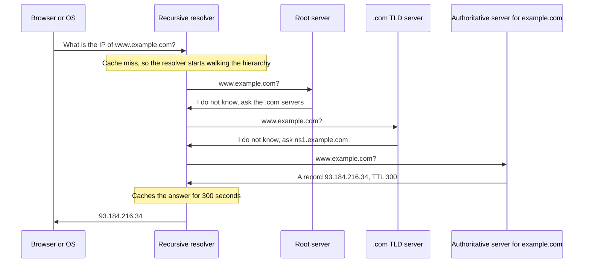
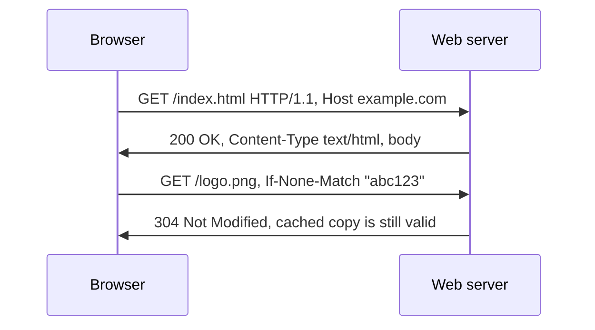
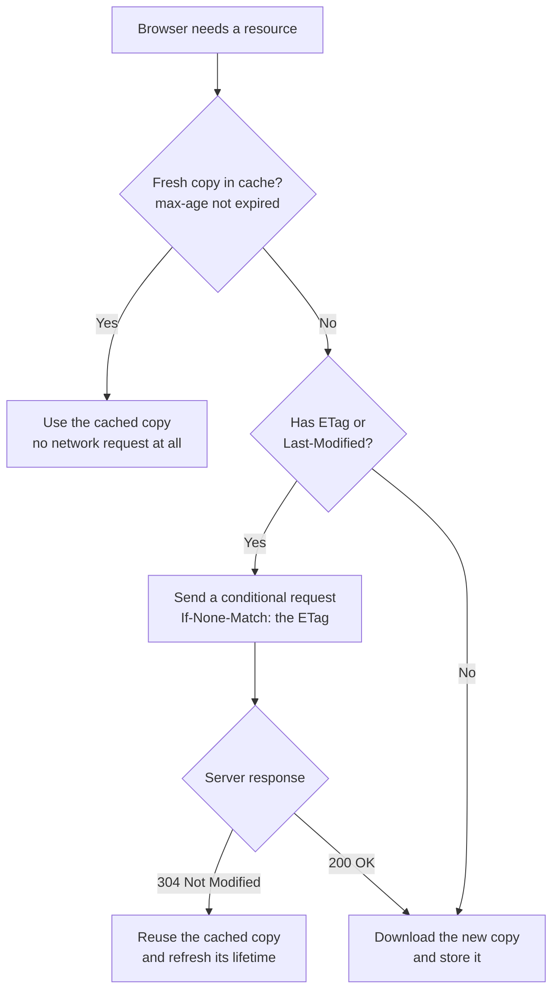
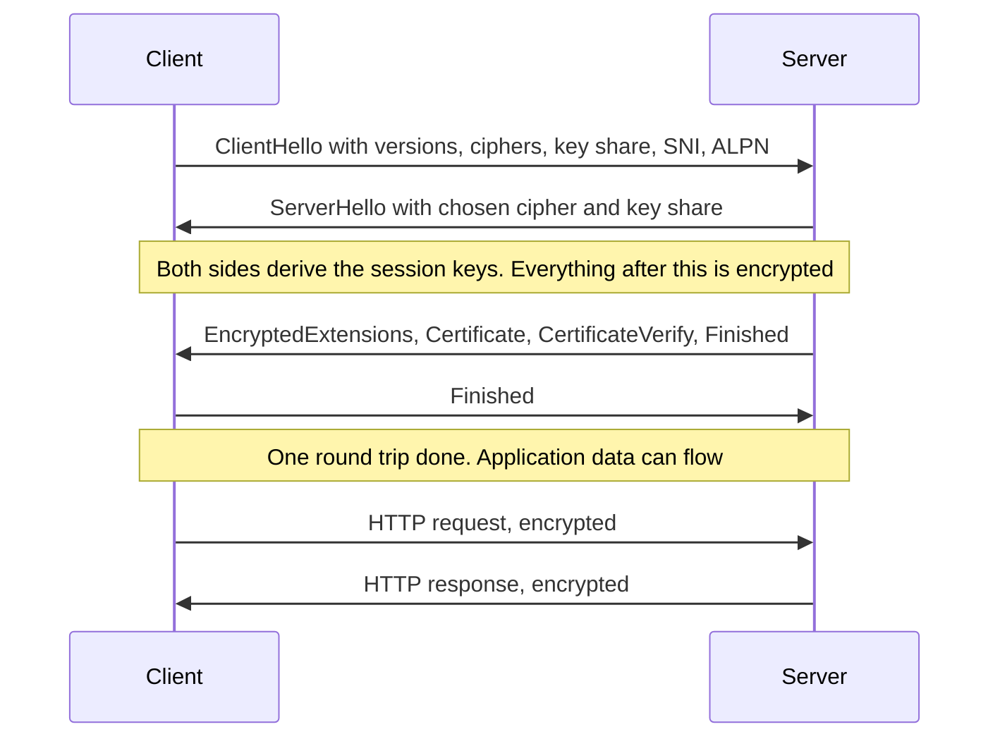
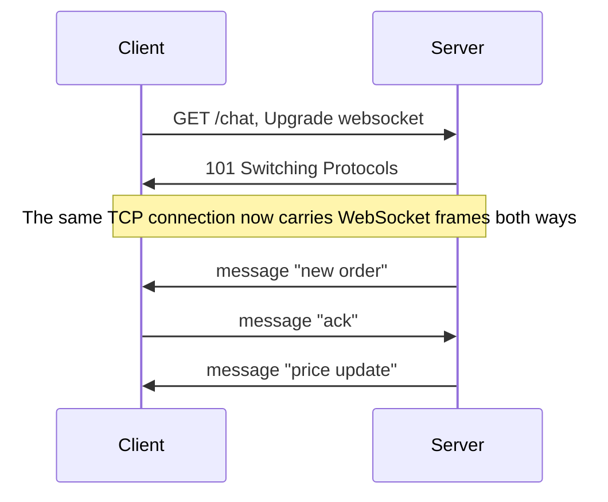
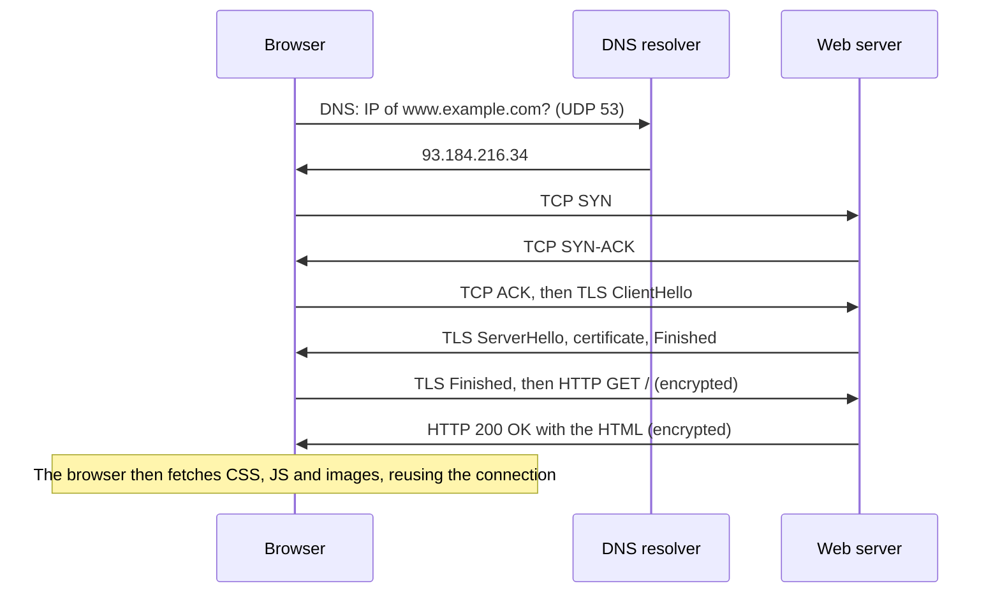

# Networking Module 4: DNS, HTTP & TLS - the Application Layer


## How this module connects to Module 3

Modules 1–3 built the road: links, IP routing, and TCP (or QUIC) for reliable delivery. Module 4 is about the **traffic on that road**: the protocols your applications actually speak. Three of them appear in almost every interview:

- **DNS** turns a name like `example.com` into an IP address.
- **HTTP** is the language the web speaks.
- **TLS** wraps a connection in encryption, which turns HTTP into **HTTPS**.

## Words you will meet in this module

| Word | Simple meaning |
|---|---|
| **Domain name** | A human-readable name such as `www.example.com`. |
| **Resolver** | A server that looks up DNS answers for you. |
| **Authoritative server** | The DNS server that holds the real records for a domain. |
| **TTL** | Time To Live: how long an answer may be cached. |
| **Record** | One DNS entry, such as an `A` record (name to IPv4 address). |
| **URL** | A web address: scheme, host, path and more. |
| **Method / status code** | What the client wants (`GET`) / how the server answered (`404`). |
| **Idempotent** | Doing it many times has the same effect as doing it once. |
| **Cookie** | A small piece of data the server asks the browser to store and send back. |
| **Certificate** | A signed document that ties a public key to a domain name. |
| **CA** | Certificate Authority: an organization trusted to sign certificates. |
| **Forward secrecy** | Old traffic stays safe even if the server's key is stolen later. |
| **SNI / ALPN** | TLS extensions that name the site you want / the protocol you want to speak. |

---

# Topic 4.1: DNS, the Internet's Phone Book

## The idea in plain words

Computers talk to IP addresses, but people remember names. **DNS** (Domain Name System) is a worldwide, distributed database that answers one question: **"what is the IP address of this name?"** (and a few related questions).

No single server knows everything. DNS is a **hierarchy**, like a phone system with area codes. Each level only knows who to ask next.

```
                    .   (root)
          ┌─────────┼─────────┐
         com       org       in        ← top-level domains (TLDs)
          │
      example                           ← the domain (second level)
          │
        www                             ← a host name

   www.example.com.   ←  read right to left: root → com → example → www
```

## The players

| Player | Job |
|---|---|
| **Stub resolver** | The small DNS client built into your OS. It asks the recursive resolver. |
| **Recursive resolver** | Does the hard work of finding the answer, and **caches** it. Run by your ISP, company, or a public service (`8.8.8.8`, `1.1.1.1`). |
| **Root servers** | Know where to find each **TLD**. There are 13 root server names (`a` to `m`), each served by many machines worldwide using **anycast**. |
| **TLD servers** | Know the authoritative servers for each domain under `.com`, `.org`, `.in` and so on. |
| **Authoritative servers** | Hold the **real records** for a domain such as `example.com`. |

## How a lookup works



Two kinds of query appear here:

- **Recursive:** "find the answer and give it to me." (Stub resolver to recursive resolver.)
- **Iterative:** "tell me who to ask next." (Recursive resolver to root, TLD and authoritative servers. Each replies with a **referral**.)

## Caching and TTL

Every answer carries a **TTL** in seconds. Resolvers (and your OS and browser) **cache** answers until the TTL expires, so most lookups never leave your network. A cached answer to `google.com` usually returns in under a millisecond.

- **Long TTL** (hours or days): fewer lookups and faster, but changes spread slowly.
- **Short TTL** (30–300 seconds): changes spread fast and failover is quicker, but more load on the authoritative servers and slightly slower first lookups.
- **Negative caching:** "this name does not exist" (**NXDOMAIN**) is cached too.

**"DNS propagation" is a myth in the sense that nothing is pushed.** When you change a record, nobody is told. Old answers simply remain in caches until their TTL runs out.

## Record types

| Type | Meaning | Example |
|---|---|---|
| **A** | Name to IPv4 address | `example.com. 300 IN A 93.184.216.34` |
| **AAAA** | Name to IPv6 address | `example.com. 300 IN AAAA 2606:2800:220:1::1` |
| **CNAME** | Alias: "this name is another name" | `www.example.com. CNAME example.com.` |
| **MX** | Mail servers for the domain, with priority | `example.com. MX 10 mail.example.com.` |
| **NS** | The authoritative name servers for the domain | `example.com. NS ns1.example.com.` |
| **TXT** | Free text: SPF, DKIM, domain ownership checks | `"v=spf1 include:_spf.example.com ~all"` |
| **SOA** | Start of authority: zone settings, serial number, negative-cache time | |
| **PTR** | Reverse lookup: IP address to name | `34.216.184.93.in-addr.arpa.` |
| **SRV** | Service location: host and port for a service | Used by many service-discovery systems |
| **CAA** | Which CAs may issue certificates for the domain | `example.com. CAA 0 issue "letsencrypt.org"` |

A **CNAME** must be the **only** record at its name, so it **cannot be placed at the zone apex** (`example.com` itself), where `SOA` and `NS` records already live. Providers offer `ALIAS` / `ANAME` / "CNAME flattening" to work around this.

## DNS on the wire and security

- DNS uses **UDP port 53** for most queries, and **TCP port 53** for large answers (the server sets a "truncated" flag), zone transfers, and other big responses. The original UDP limit was 512 bytes. **EDNS0** allows larger UDP messages.
- Plain DNS is **not encrypted and not authenticated**. Attackers can spy on it, or forge answers (**DNS spoofing or cache poisoning**).
- **DNSSEC** adds digital signatures to records, so a resolver can verify an answer is genuine. It proves authenticity. It does **not** encrypt.
- **DNS over TLS (DoT, port 853)** and **DNS over HTTPS (DoH, port 443)** encrypt the queries between the client and the resolver.

## Using DNS for traffic steering

- **Round-robin DNS:** several `A` records for one name. Clients get them in rotating order. Simple, but has no health checks.
- **GeoDNS or latency-based DNS:** the answer depends on where the user is.
- **Health-checked records:** a managed DNS service removes unhealthy servers from answers.
- **Limits:** caches ignore your health checks until TTLs expire, and some clients cache longer than the TTL. DNS steering is coarse. Real load balancing (Module 5) works at the connection or request level.

## Look at DNS yourself

```
$ dig example.com A +noall +answer
example.com.    300    IN    A    93.184.216.34
            │     │     │    │         └ the data
            │     │     │    └ record type
            │     │     └ class (IN = Internet)
            │     └ TTL in seconds (counts down while cached)
            └ name

$ dig +trace example.com        # follow the hierarchy: root, then TLD, then authoritative
$ dig @8.8.8.8 example.com      # ask a specific resolver
$ dig example.com MX +short     # mail servers
```

## Interview traps

- "DNS is just one lookup." It is a **chain of lookups** (cached in most cases). A cold lookup can take several round trips.
- "I changed the record, so the whole world sees it." Not until caches expire. Lower the TTL **before** a planned migration, not after.
- **DNS is a hidden dependency of nearly everything.** When DNS fails, applications "fail" in strange ways. In 2021, Facebook's DNS servers became unreachable (their routes were withdrawn, Module 2), and the sites and many internal tools went down with them.
- CNAME at the apex is not allowed. Also, a CNAME chain adds extra lookups.
- Browsers, operating systems and some applications (for example Java) each keep **their own DNS cache**, so "flush the DNS cache" may need doing in several places.

## Tricky questions and answers

### Q1 [SDE-1/2]: What happens when you look up `www.example.com` with an empty cache?

**Answer:** The OS asks its configured recursive resolver. The resolver, finding nothing cached, asks a **root server**, which refers it to the `.com` **TLD servers**. A TLD server refers it to the **authoritative servers** for `example.com`. The authoritative server returns the `A` record with a TTL. The resolver caches the answer (and the referrals, so next time it can skip steps), and returns the address to the client, which caches it as well. The first lookup takes several round trips. Later lookups are served from cache until the TTL expires.

### Q2 [SDE-2]: You changed a server's IP and updated the `A` record, but some users still reach the old server for hours. Why, and how do you plan better?

**Answer:** Resolvers, operating systems and browsers cache the old answer until its **TTL** expires. If the TTL was 24 hours, some users will keep the old IP for up to a day, and some clients cache longer than asked. Better plan: **lower the TTL** (for example to 60 seconds) at least one full old-TTL period **before** the change, make the change, verify, then raise the TTL again. Keep the **old server running** and forwarding traffic until the old TTL has certainly expired.

### Q3 [SDE-2]: Why can't you put a CNAME on `example.com` itself?

**Answer:** A CNAME means "everything about this name is the same as that other name," so it must be the **only** record at the name. The apex of a zone must also have **SOA** and **NS** records, which would conflict. Solutions: use an `A`/`AAAA` record at the apex, or a DNS provider's **ALIAS / ANAME / CNAME flattening** feature, which resolves the target on the provider's side and returns plain `A` records.

### Q4 [SDE-3]: How would you use DNS for failover between two data centers, and what are the limits?

**Answer:** Use a **health-checked** DNS service with a **short TTL** (30–60 seconds): it answers with the primary data center's IP while it is healthy, and switches to the secondary when checks fail. Limits: switchover takes at least **one TTL plus detection time**, some resolvers and clients **ignore small TTLs**, long-lived connections already established do not move, and caching hides the change from many users for a while. For faster failover, combine DNS with **anycast** or a **global load balancer** in front, so the IP stays the same while traffic is redirected behind it.

---

# Topic 4.2: HTTP: the Language of the Web

## The idea in plain words

**HTTP** (HyperText Transfer Protocol) is a **request and response** protocol. A client (usually a browser or an app) sends a request. A server sends back one response. That is the whole idea.

HTTP is **stateless**: the server treats each request on its own and does not remember earlier ones. If a site "remembers you," it is using extra tools: **cookies**, sessions and tokens (below).



## The anatomy of a URL

```
https://user@www.example.com:8443/path/page?name=ana&id=7#section2
└─┬──┘   └─┬─┘ └────┬──────┘ └─┬─┘└───┬────┘└─────┬─────┘└───┬───┘
scheme  userinfo    host     port   path       query     fragment
```

- The **fragment** (`#section2`) is used by the browser only. It is **never sent to the server**.
- The default port is 80 for `http` and 443 for `https`.

## A request and a response

```
GET /search?q=network HTTP/1.1          ← request line: method, path, version
Host: www.example.com                   ← required in HTTP/1.1: which site
User-Agent: curl/8.4.0
Accept: text/html                       ← what the client can handle
Cookie: session=abc123                  ← data the server asked us to send back
                                        ← blank line ends the headers
(body, if any)

HTTP/1.1 200 OK                         ← status line: version, code, reason
Content-Type: text/html; charset=utf-8
Content-Length: 1256
Cache-Control: max-age=3600
Set-Cookie: session=abc123; Secure; HttpOnly; SameSite=Lax

<html>...</html>                        ← body
```

## Methods

| Method | Purpose | Safe* | Idempotent** |
|---|---|---|---|
| **GET** | Read a resource | Yes | Yes |
| **HEAD** | Like GET, but headers only | Yes | Yes |
| **OPTIONS** | Ask what is allowed (also used for CORS preflight) | Yes | Yes |
| **POST** | Create something, or run an action | No | **No** |
| **PUT** | Replace a resource completely | No | Yes |
| **PATCH** | Change part of a resource | No | Not guaranteed |
| **DELETE** | Remove a resource | No | Yes |

\*Safe = does not change server state. \*\*Idempotent = repeating it has the same effect as doing it once.

## Status codes

| Class | Meaning | Codes to know |
|---|---|---|
| **1xx** | Informational | `101` Switching Protocols (WebSocket upgrade) |
| **2xx** | Success | `200` OK, `201` Created, `204` No Content |
| **3xx** | Redirect | `301` Moved Permanently, `302` Found (temporary), `304` Not Modified, `307` Temporary Redirect, `308` Permanent Redirect |
| **4xx** | **Client** error | `400` Bad Request, `401` Unauthorized (not authenticated), `403` Forbidden (not allowed), `404` Not Found, `405` Method Not Allowed, `409` Conflict, `429` Too Many Requests |
| **5xx** | **Server** error | `500` Internal Server Error, `502` Bad Gateway, `503` Service Unavailable, `504` Gateway Timeout |

Remember: `307` and `308` keep the **same method** (a POST stays a POST), while `301` and `302` are often turned into a GET by clients.

## Important headers

| Header | Purpose |
|---|---|
| `Host` | Which site on this server (many sites share one IP). |
| `Content-Type` / `Content-Length` | What the body is, and how big. |
| `Accept` | What formats the client can handle (content negotiation). |
| `Authorization` | Credentials, such as `Bearer <token>`. |
| `Cookie` / `Set-Cookie` | Send / store cookies. |
| `Cache-Control`, `ETag`, `If-None-Match` | Caching (see below). |
| `Location` | Where to go, in redirect responses. |
| `User-Agent` | Which client is making the request. |

## Caching

Caching is why the web feels fast. The server controls it with headers.



| `Cache-Control` value | Meaning |
|---|---|
| `max-age=3600` | May be reused for 3600 seconds without asking. |
| `no-cache` | May be stored, but **must be revalidated** with the server before each use. |
| `no-store` | **Do not store at all** (sensitive data). |
| `public` / `private` | Shared caches (CDNs) may / may not store it. |

`no-cache` does **not** mean "do not cache." It means "always check first." `no-store` is the one that forbids storing.

## State: cookies, sessions and tokens

Since HTTP is stateless, a login is remembered like this: the server sends `Set-Cookie: session=abc123`, the browser sends `Cookie: session=abc123` on every later request, and the server looks up the session. Important cookie attributes:

| Attribute | Protects against |
|---|---|
| `Secure` | Sending the cookie over plain HTTP |
| `HttpOnly` | JavaScript reading the cookie (stops theft through XSS) |
| `SameSite=Lax/Strict` | Cross-site requests sending the cookie (helps against CSRF) |

Alternatives: **tokens** such as **JWTs** sent in the `Authorization` header, which let servers stay stateless but are harder to revoke.

## Try it

```
$ curl -v https://example.com 2>&1 | head -20
> GET / HTTP/2
> Host: example.com
> User-Agent: curl/8.4.0
> Accept: */*
< HTTP/2 200
< content-type: text/html; charset=UTF-8
< cache-control: max-age=604800
< etag: "3147526947+gzip"
```

`>` lines are what you sent. `<` lines are what you received.

## Interview traps

- "POST is for writing and GET is for reading, so there is no difference beyond that." The real differences are **safety and idempotency**, caching (GET responses can be cached), and that GET parameters appear in URLs and logs.
- `401` vs `403`: **401** = "I do not know who you are" (authenticate). **403** = "I know who you are, and you may not do this."
- `502` vs `503` vs `504`: **502** = a proxy got an invalid response from the upstream. **503** = the service is overloaded or down. **504** = the upstream did not respond in time.
- **`no-cache` vs `no-store`** (see above) is a common trick.
- Sending secrets in the URL (query string) leaks them into logs, browser history and the `Referer` header.
- The browser's **same-origin policy** and **CORS** (Cross-Origin Resource Sharing) are enforced by the **browser**. The server only sends `Access-Control-Allow-*` headers. A "CORS error" does not stop `curl` from working.

## Tricky questions and answers

### Q1 [SDE-1/2]: What is the difference between PUT, POST and PATCH?

**Answer:** **POST** creates a new resource where the server chooses the ID, or triggers an action. It is **not idempotent**, so repeating it can create duplicates. **PUT** replaces the resource at a known URL with the complete body you send, and is **idempotent** (sending it twice gives the same result). **PATCH** changes only part of a resource, and is not guaranteed to be idempotent (for example "increase by 1").

### Q2 [SDE-2]: How does a login persist if HTTP is stateless?

**Answer:** The client sends a credential once. The server creates a **session** (a record on the server) or a **signed token**, and sends back an identifier in a `Set-Cookie` header (or in the response body, for tokens). The browser attaches it to every later request. With **server-side sessions**, the server looks up the ID in a store (a database or Redis). With **JWTs**, the token itself carries signed claims and the server only verifies the signature. Cookies should be `Secure`, `HttpOnly` and `SameSite`, and expire after a sensible time.

### Q3 [SDE-2/3]: A user's browser times out on a payment `POST` and they click "pay" again. How do you avoid charging twice?

**Answer:** Make the operation **idempotent** with an **idempotency key**. The client generates a unique key (a UUID) for each payment attempt and sends it in a header (`Idempotency-Key`). The server stores the key together with the result. If a request arrives with a key it has already processed, it returns the **saved result** instead of charging again. The key must be stored **atomically** with the operation (a unique constraint in the database), and expire after some days. This pattern is used by payment APIs.

### Q4 [SDE-3]: Explain the full caching flow, and what you would do to make a static site both fast and instantly updatable.

**Answer:** The browser checks its cache: if the response is still **fresh** (`max-age` not expired), it uses it with **no network request**. If it is stale and the stored response had an **ETag**, the browser sends a **conditional request** (`If-None-Match`). The server answers **304 Not Modified** with no body if nothing changed, saving bandwidth. For a static site: give files **fingerprinted names** (`app.3f9a1c.js`) and a very long `max-age` plus `immutable`, because a new build gets a new name. Keep the HTML entry page on a **short max-age or `no-cache`**, so it always points at the latest fingerprinted files. Put a **CDN** in front to cache close to users.

---

# Topic 4.3: HTTP/1.1, HTTP/2 and HTTP/3

## The idea in plain words

The meaning of HTTP (methods, status codes, headers) stayed the same across versions. What changed is **how messages are carried on the wire**, to load pages faster. Each version fixes the main pain of the one before.

## The evolution

| Version | Year | Key idea | Main problem it left |
|---|---|---|---|
| **HTTP/1.0** | 1996 | One request per TCP connection, then close | A handshake (and slow start) for every file |
| **HTTP/1.1** | 1997 | **Persistent connections** (keep-alive) by default, `Host` header, chunked transfer, caching improvements | One request at a time per connection: **HTTP-level head-of-line blocking** |
| **HTTP/2** | 2015 | **Binary framing**, **multiplexing** many streams on one TCP connection, **header compression** (HPACK) | **TCP-level head-of-line blocking**: one lost packet stalls all streams |
| **HTTP/3** | 2022 | Runs on **QUIC (over UDP)**: independent streams, faster handshake, connection migration | Needs UDP to be allowed. More CPU use |

## What each version does in practice

**HTTP/1.1:**

- Keeps a connection open for reuse, but a connection handles **one request at a time**. A slow response blocks the ones behind it.
- *Pipelining* (sending several requests without waiting) exists but was almost never used because of head-of-line problems.
- So browsers open **about 6 connections per host** to load things in parallel, and sites used workarounds: **domain sharding** (many hostnames), **sprite sheets** and bundling.

**HTTP/2:**

- Messages are cut into small **binary frames** that belong to numbered **streams**. Many requests and responses are **interleaved on a single TCP connection**.
- **HPACK** compresses repetitive headers (cookies and user agents repeat on every request).
- The workarounds from HTTP/1.1 (domain sharding, bundling everything) become **unhelpful or harmful**. Sharding even hurts, because it creates extra connections with their own handshakes and slow start.
- It is nearly always used over TLS (browsers require it).
- *Server push* was designed, but proved hard to use well and is being removed from browsers.
- Remaining problem: a single lost TCP segment stalls **every stream**, because TCP delivers bytes in order.

**HTTP/3:**

- Uses **QUIC** (Module 3): streams are independent at the transport level, so a loss on one stream does not block others.
- The transport and TLS 1.3 handshakes are **combined** (1 RTT, or 0-RTT on resumption), and connections **survive IP changes** (for example switching from Wi-Fi to mobile data).
- A browser learns that a server supports HTTP/3 from an **`Alt-Svc`** header or a DNS record, and falls back to HTTP/2 if UDP is blocked.

**How the version is chosen:** during the TLS handshake, the **ALPN** extension lets the client and server agree: `h2` (HTTP/2), `http/1.1`, or (for QUIC) `h3`.

## Interview traps

- "HTTP/2 is always faster." Usually, but on **lossy networks** (mobile), one TCP loss stalls all streams, and it can be **slower** than several HTTP/1.1 connections. That is the case HTTP/3 fixes.
- "HTTP/2 needs a code change in the application." No. The semantics are unchanged. Servers and proxies translate. But old **optimizations** (sharding, giant bundles) should be reconsidered.
- HTTP/1.1 "keep-alive" is not the same as **pipelining**.
- HTTP/2 multiplexing solves **HTTP-level** head-of-line blocking, not **TCP-level**.

## Tricky questions and answers

### Q1 [SDE-2]: Why did HTTP/1.1 browsers open about 6 connections to one host, and why is that no longer needed in HTTP/2?

**Answer:** In HTTP/1.1 one connection handles **one request at a time**, so a browser opens several connections to download many resources in parallel (browsers limit this to about 6 per host to protect servers). In HTTP/2, many requests are **multiplexed over one connection** as interleaved streams, so a single connection is enough, and it is **better**: it needs one handshake, one slow start, and shares one congestion window fairly.

### Q2 [SDE-3]: HTTP/2 fixed head-of-line blocking, so why was HTTP/3 needed?

**Answer:** HTTP/2 fixed it at the **HTTP level** (many streams on one connection), but all those streams share **one TCP byte stream**. If a single segment is lost, TCP holds back everything after it until the retransmission arrives, so **every stream stalls**, even those whose data had arrived. This is **TCP-level head-of-line blocking**, and it cannot be fixed without changing TCP, which is in OS kernels and handled by middleboxes. HTTP/3 uses **QUIC over UDP**, where streams are independent, so only the affected stream waits.

---

# Topic 4.4: TLS and HTTPS

## The idea in plain words

Plain HTTP is like sending a **postcard**: anyone along the way can read it or change it. **TLS** (Transport Layer Security, the successor to SSL) wraps the connection so that it provides three things:

1. **Confidentiality:** nobody in the middle can read the data (encryption).
2. **Integrity:** nobody can change the data without being noticed.
3. **Authentication:** you are really talking to `example.com`, not an impostor (certificates).

**HTTPS** is simply **HTTP carried inside TLS**, usually on port 443.

## Two kinds of cryptography, used together

| Kind | Idea | Speed | Used for |
|---|---|---|---|
| **Asymmetric** (public key) | A key **pair**: what one key locks, only the other opens | Slow | Agreeing on a shared secret, and **signatures** |
| **Symmetric** | **One shared key** for both locking and unlocking | **Very fast** | Encrypting all the actual data (AES-GCM, ChaCha20-Poly1305) |

TLS is a **hybrid**: it uses the slow asymmetric part briefly, to **agree on a secret session key** and to prove identity, and then switches to fast symmetric encryption for everything else.

## Certificates and the chain of trust

A **certificate** says "this public key belongs to `example.com`," and is **signed** by a **Certificate Authority (CA)**. It contains the domain names (the **SAN** list), the public key, the issuer, and the validity dates.

Why does your browser trust it? Through a **chain**:

```
Root CA certificate        ← already stored in your OS or browser "trust store"
   └─ signed
Intermediate CA certificate   ← sent by the server
   └─ signed
Leaf certificate (example.com)  ← sent by the server
```

The server sends the **leaf and the intermediates**. The browser checks that every signature leads up to a **root it already trusts**. The root is never sent.

The browser also checks that:

- the certificate's **dates are valid** (not expired, not yet valid),
- the **hostname matches** a name in the certificate,
- the certificate has **not been revoked** (via **OCSP**, ideally **stapled** by the server, or revocation lists),
- it appears in **Certificate Transparency** logs (public records of issued certificates).

Free CAs such as **Let's Encrypt** use **ACME** to issue and renew certificates automatically. Certificate lifetimes keep getting shorter, so **automated renewal** is essential.

## The TLS 1.3 handshake (1 round trip)



How it works:

1. The client sends a **key share** (its half of an **ephemeral Diffie-Hellman** exchange) along with its supported ciphers.
2. The server replies with **its** key share. Now both can compute the **same shared secret**, without ever sending it.
3. The server proves its identity: it sends its **certificate** and a **signature** (`CertificateVerify`) made with its private key over the handshake, which only the real owner can create.
4. Both sides send `Finished` messages that confirm nothing was tampered with.

**Forward secrecy:** because the keys come from **ephemeral** (one-time) values, stealing the server's long-term private key later **cannot decrypt recorded old traffic**. TLS 1.3 makes this mandatory.

## TLS versions and costs

| | TLS 1.2 | **TLS 1.3** |
|---|---|---|
| Handshake | **2** round trips | **1** round trip |
| Resumption | Session tickets or IDs | 1 RTT, or **0-RTT** (early data) |
| Forward secrecy | Optional (depends on cipher suite) | **Always** |
| Weak algorithms | Many legacy options remain | **Removed** |
| Handshake privacy | Certificate sent in the clear | Certificate **encrypted** |

TLS 1.0 and 1.1 are **deprecated**. **0-RTT** lets a returning client send data in its very first message, but that data can be **replayed** by an attacker, so it must only be used for **idempotent** requests such as GET.

## Useful extensions

- **SNI** (Server Name Indication): the client names the site it wants in the `ClientHello`, so a server hosting many domains on one IP can present the right certificate. (It is visible in the clear unless **Encrypted Client Hello** is used.)
- **ALPN:** negotiates the application protocol: `h2`, `http/1.1`, `h3`.
- **HSTS** (`Strict-Transport-Security` header): tells browsers "only ever use HTTPS for this site," blocking **downgrade** attacks.
- **mTLS** (mutual TLS): the **client** also presents a certificate, so both sides are authenticated. Common for service-to-service traffic.

## The cost of setting up a connection

Time before the first byte of an HTTPS request can be **sent**, with round-trip time `RTT`:

| Stack | Round trips before the request goes out |
|---|---|
| TCP + TLS 1.2 | 1 (TCP) + 2 (TLS) = **3 RTT** |
| TCP + TLS 1.3 | 1 (TCP) + 1 (TLS) = **2 RTT** |
| QUIC (HTTP/3), first visit | **1 RTT** |
| QUIC, returning visitor (0-RTT) | **0 RTT** |

(Add one more RTT for DNS if the name is not cached, and the request itself needs one RTT to come back.)

## Look at TLS yourself

```
$ openssl s_client -connect example.com:443 -servername example.com </dev/null 2>/dev/null \
    | openssl x509 -noout -subject -issuer -dates
subject=CN = www.example.org
issuer=C = US, O = DigiCert Inc, CN = DigiCert Global G2 TLS RSA SHA256 2020 CA1
notBefore=Jan 30 00:00:00 2025 GMT
notAfter=Mar  1 23:59:59 2026 GMT
```

(The values will differ. `-servername` sends SNI.) `curl -v https://example.com` also prints the handshake details, including the TLS version, the cipher and the certificate checks.

## Interview traps

- "HTTPS hides everything." The **content** is encrypted, but an observer still sees the **destination IP**, the **SNI** (unless ECH), packet sizes and timing.
- "Asymmetric encryption protects the data." It only protects the **key agreement** and the signatures. The data itself uses **symmetric** encryption.
- **Where TLS terminates:** a load balancer or CDN may decrypt traffic and forward it in plain text or re-encrypt it. Mention this in design questions.
- Common certificate errors: **expired**, **hostname mismatch**, **incomplete chain** (the server forgot to send the intermediate certificate), **self-signed**, and a **wrong system clock** on the client.
- A padlock means the connection is encrypted and the certificate is valid. It does **not** mean the site is trustworthy (phishing sites can have valid certificates).

## Tricky questions and answers

### Q1 [SDE-2]: Explain what happens in a TLS handshake, and why TLS uses both asymmetric and symmetric cryptography.

**Answer:** The client and server agree on a TLS version and cipher, perform a **key exchange** (ephemeral Diffie-Hellman) so both compute the same **session key** without sending it, and the server proves its identity with a **certificate** and a **signature** made with its private key. Then both switch to **symmetric encryption** with the session key. Asymmetric cryptography is **slow** but solves two problems that symmetric cannot: **agreeing on a secret over an open network**, and **authentication** with signatures. Symmetric cryptography is **fast**, so it carries the bulk of the data.

### Q2 [SDE-2]: A client reports "unable to verify the first certificate," but the certificate is valid and the site works in a browser. What is the likely cause?

**Answer:** The server is probably sending **only the leaf certificate** and **not the intermediate certificate**. Browsers can often fetch missing intermediates themselves (or have them cached), but command-line tools, Java and many libraries cannot, so they cannot build the chain to a trusted root. Fix it by configuring the server to send the **full chain** (leaf plus intermediates, in order). Verify with `openssl s_client -connect host:443 -showcerts`.

### Q3 [SDE-2/3]: What is forward secrecy and why does it matter?

**Answer:** With forward secrecy, each connection's session keys come from **ephemeral** key exchange values that are thrown away afterwards. So if an attacker records encrypted traffic today and steals the server's **private key** next year, they **still cannot decrypt** the recorded sessions. Without it (for example, old RSA key exchange), the same private key could unlock all past recordings. TLS 1.3 makes forward secrecy mandatory.

### Q4 [SDE-3]: Should you terminate TLS at the load balancer or on each server? What are the trade-offs?

**Answer:** **At the load balancer or CDN:** central certificate management, less CPU on servers, and the balancer can **inspect and route on HTTP content** (Layer 7). But traffic behind it is unencrypted unless you **re-encrypt**, which is a risk in shared networks or for compliance. **End-to-end TLS to each server (or re-encryption):** traffic stays encrypted inside your network, and supports **mTLS** between services, but it needs certificates and more CPU on every server and makes inspection harder. Many designs terminate at the edge and then use **re-encryption or a service mesh with mTLS** inside.

### Q5 [SDE-3]: What is TLS 0-RTT and what is the danger?

**Answer:** When a client has connected before, it can use a stored **pre-shared key** to send **application data in its very first flight**, saving a round trip. The risk is **replay**: an attacker who captured that first flight can send it again, and the server may process it twice. It also lacks forward secrecy for that early data. So servers should accept 0-RTT only for **safe, idempotent** requests such as `GET`, or reject it, and applications must not treat early data as unique.

---

# Topic 4.5: Other Application Protocols and Real-Time Patterns

## The idea in plain words

HTTP is not the only language on top of TCP. And plain request-and-response is not enough when a server needs to **push** data to a client, such as chat messages, live prices or notifications. This topic maps the common choices.

## Common application protocols

| Protocol | Port | Transport | Purpose |
|---|---|---|---|
| **SSH** | 22 | TCP | Secure remote login and file copy (`scp`, `sftp`) |
| **SMTP** | 25 / 587 | TCP | **Sending** email between servers (587 for clients, with TLS) |
| **IMAP / POP3** | 993 / 995 (TLS) | TCP | **Reading** email from a mailbox |
| **FTP / SFTP** | 21 / 22 | TCP | File transfer (FTP is unencrypted. SFTP runs over SSH) |
| **DNS** | 53 | UDP / TCP | Name resolution |
| **DHCP** | 67 / 68 | UDP | Automatic IP configuration |
| **NTP** | 123 | UDP | Time synchronization |
| **HTTP / HTTPS** | 80 / 443 | TCP (or QUIC) | The web and most APIs |

## Getting data from server to client

| Technique | How it works | Direction | Notes |
|---|---|---|---|
| **Polling** | The client asks every N seconds | Client to server | Simple, but wasteful and delayed |
| **Long polling** | The server holds the request open until it has data, then the client asks again | Server to client | Works everywhere. Costly under load |
| **Server-Sent Events (SSE)** | One long HTTP response that streams events | **One-way**, server to client | Simple. Reconnects automatically |
| **WebSocket** | An HTTP request is **upgraded** (`101 Switching Protocols`) to a full-duplex channel over the same TCP connection | **Two-way** | Low latency. Needs connection management and scaling work |
| **gRPC streaming** | Binary messages (Protocol Buffers) over HTTP/2 | One-way or two-way | Strongly typed, popular for service-to-service calls |



## Interview traps

- "WebSocket is a different network." It starts as an **HTTP request** on port 80 or 443, and then upgrades the same TCP connection.
- A WebSocket server keeps a **long-lived TCP connection per client**, so scaling means thinking about file descriptors, memory, **load balancer idle timeouts**, **heartbeats (ping/pong)**, and how to route a message to the server that holds the right connection.
- SSE is often **enough** and simpler than WebSocket for one-way updates such as notifications or feeds.
- Plain FTP and plain HTTP send passwords and data **unencrypted**. Use SFTP and HTTPS.

## Tricky question and answer

### Q1 [SDE-2/3]: You must add live notifications to a web app with millions of users. Compare your options.

**Answer:** **Polling** is simplest but wastes requests and has delay. **Long polling** reduces delay but holds a request open per user. **SSE** gives a simple, one-way, automatically reconnecting stream over normal HTTP, ideal for notifications and feeds. **WebSocket** gives two-way, low-latency messaging, best for chat, collaboration and games, but is more complex to scale. For one-way notifications I would start with **SSE (or WebSocket if two-way is needed)**, and design for scale: terminate connections on a **dedicated tier**, use a **pub/sub system** (such as Redis or Kafka) so any server can deliver to the server holding the user's connection, send **heartbeats** to detect dead connections, set **load balancer timeouts** correctly, and make clients **reconnect with backoff and jitter** to avoid a thundering herd after an outage.

---

# Topic 4.6: Putting It Together: One Page Load, Step by Step

## The idea in plain words

When you open `https://www.example.com` for the first time, everything in this module and the last three runs in a chain. This is a short version. Module 6 expands it for system design interviews.



## The latency bill (example with RTT = 50 ms)

| Step | Round trips | Time |
|---|---|---|
| DNS lookup (if not cached) | 1 to the resolver, and more if it must walk the hierarchy | ~20–100 ms |
| TCP handshake | 1 | 50 ms |
| TLS 1.3 handshake | 1 | 50 ms |
| HTTP request to first byte | 1 (plus the server's processing time) | 50 ms + server time |
| **Total before the first byte arrives** | | **about 170–250 ms** |

## How each layer helps you go faster

| Technique | What it removes |
|---|---|
| **DNS caching, `dns-prefetch`** | DNS lookup time |
| **Keep-alive and connection reuse** | The TCP and TLS handshakes for later requests |
| **TLS 1.3 and session resumption** | One or more TLS round trips |
| **HTTP/2 multiplexing** | Extra connections and HTTP-level blocking |
| **HTTP/3 (QUIC)** | TCP + TLS handshake stacking, and TCP head-of-line blocking |
| **CDN** | Distance: shorter RTT for every step |
| **Caching headers** | Whole requests |
| **Compression (gzip, Brotli)** | Bytes to send |

## Measure it yourself

```
$ curl -s -o /dev/null -w "dns: %{time_namelookup}\nconnect: %{time_connect}\ntls: %{time_appconnect}\nfirst byte: %{time_starttransfer}\ntotal: %{time_total}\n" https://example.com
dns: 0.021
connect: 0.045
tls: 0.098
first byte: 0.152
total: 0.153
```

Each value is the **cumulative time** since the start. `connect` minus `dns` is roughly the TCP handshake, `tls` minus `connect` is the TLS handshake, and `first byte` minus `tls` is the request round trip plus server processing. (Your numbers will differ.)

---

# Hands-On Lab: DNS, HTTP and TLS

```
1. dig example.com A +noall +answer          # note the TTL, then run it again and watch it count down
2. dig +trace example.com                    # follow root, TLD and authoritative servers
3. dig example.com MX +short                 # mail servers
4. dig @8.8.8.8 example.com                  # ask a different resolver
5. curl -I https://example.com               # headers only (a HEAD request)
6. curl -v https://example.com 2>&1 | head -40   # see the TLS handshake and the HTTP exchange
7. curl --http1.1 -sI https://example.com    # force HTTP/1.1 and compare with the default
8. openssl s_client -connect example.com:443 -servername example.com </dev/null | openssl x509 -noout -dates -issuer
9. The curl -w timing command from Topic 4.6  # find which step takes the longest for you
```

Questions to answer for yourself:

- What TTL does your `A` record show, and what happens to it on the second query?
- Which HTTP version did `curl -v` use by default? How can you tell?
- Who issued the certificate, and when does it expire? What would happen on that date?
- In your timing output, is DNS, TCP, TLS or the server the biggest part?

---

# Module 4 Cheat Sheet

| Concept | One-line interview answer |
|---|---|
| DNS | Distributed hierarchical database: root, TLD, authoritative. Recursive resolvers cache answers. |
| Lookup | Stub, recursive resolver, then root, TLD, authoritative via referrals. Cached by TTL at every level. |
| Record types | A, AAAA, CNAME (alias, not at apex), MX, NS, TXT, SOA, PTR, SRV, CAA. |
| DNS changes | No push. Old answers live until TTL expires. Lower TTL before a migration. |
| DNS security | Plain DNS is unencrypted and spoofable. DNSSEC authenticates. DoT (853) and DoH (443) encrypt. |
| HTTP | Stateless request and response. Cookies, sessions and tokens add state. |
| Methods | GET, HEAD, OPTIONS are safe. GET, HEAD, PUT, DELETE, OPTIONS are idempotent. POST is not. |
| Status codes | 2xx ok, 3xx redirect, 4xx client error, 5xx server error. 401 = who are you, 403 = not allowed. 502/503/504 gateway, down, timeout. |
| Caching | `max-age` fresh, `no-cache` = revalidate, `no-store` = never store. ETag plus 304 saves bandwidth. |
| HTTP/1.1 | Keep-alive, one request at a time per connection, so about 6 connections per host. |
| HTTP/2 | Binary frames, multiplexing, HPACK, one TCP connection. TCP HOL blocking remains. |
| HTTP/3 | HTTP over QUIC (UDP). Independent streams, faster handshake, connection migration. |
| TLS goals | Confidentiality, integrity, authentication. Hybrid: asymmetric for key exchange and signatures, symmetric for data. |
| Certificates | Chain: leaf, intermediate, trusted root. Checked for signature, dates, hostname, revocation. |
| TLS 1.3 | 1 RTT, forward secrecy mandatory, weak ciphers removed. 0-RTT has replay risk. |
| Setup cost | TCP+TLS1.2 = 3 RTT. TCP+TLS1.3 = 2 RTT. QUIC = 1 RTT (0 on resume). |
| SNI / ALPN / HSTS / mTLS | Which site / which protocol / force HTTPS / client certificate too. |
| Real-time | Polling, long polling, SSE (one-way), WebSocket (two-way), gRPC streaming. |

