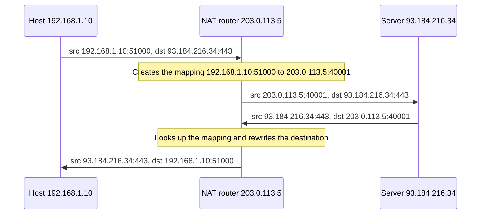
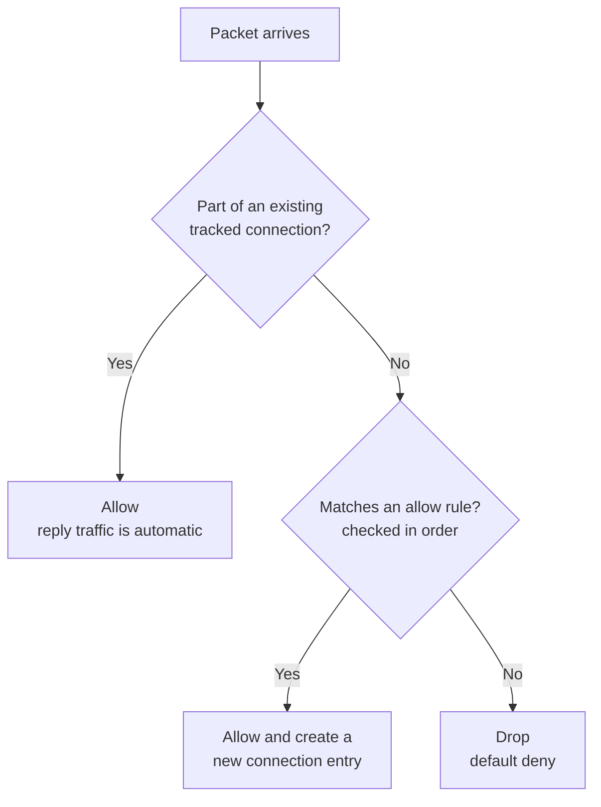
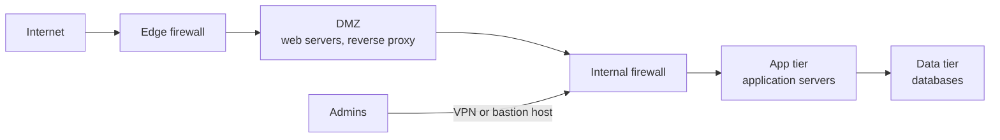
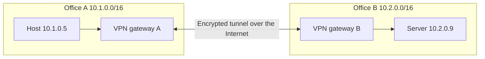
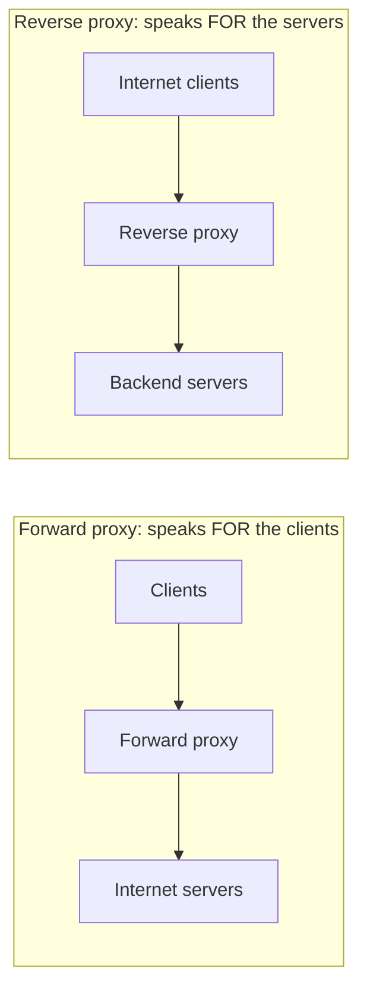
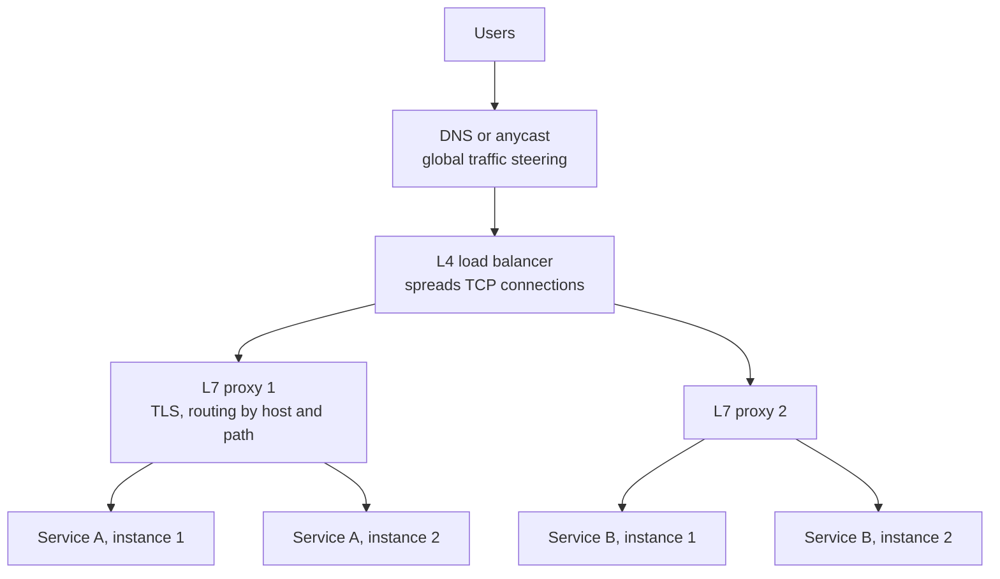
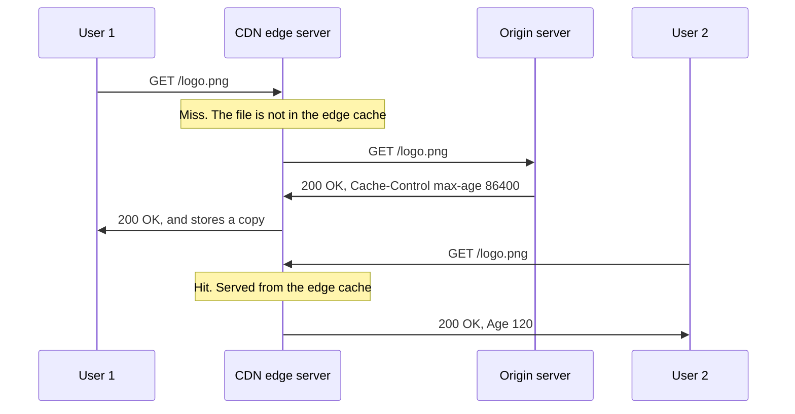
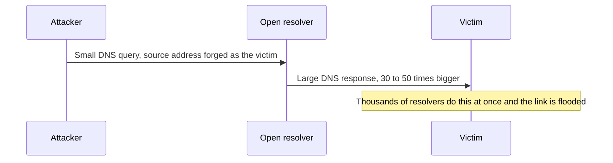

# Networking Module 5: Firewalls, NAT, VPNs & Load Balancing


## How this module connects to Module 4

Modules 1–4 followed one request from end to end: addressing, routing, TCP, DNS, HTTP and TLS. But in the real world a request never goes straight from client to server. **Boxes in the middle** touch it along the way:

- **NAT** rewrites its addresses.
- **Firewalls** decide whether it may pass.
- **VPNs and proxies** wrap it, hide it or redirect it.
- **Load balancers and CDNs** decide which machine, and which city, will answer it.

Each of these boxes uses the details you learned earlier (IP addresses, ports, TCP state, TLS and HTTP), so this module is where they become practical.

## Words you will meet in this module

| Word | Simple meaning |
|---|---|
| **NAT / PAT** | Network Address Translation / Port Address Translation: rewriting addresses and ports as packets pass through. |
| **Stateful** | Remembers connections and uses that memory to decide. |
| **Stateless** | Judges every packet on its own, with no memory. |
| **ACL** | Access Control List: an ordered list of allow and deny rules. |
| **Security group** | A cloud firewall attached to an instance. |
| **DMZ** | A zone between the Internet and the internal network, holding public-facing servers. |
| **Tunnel** | A packet carried inside another packet. |
| **Proxy** | A server that makes requests on behalf of someone else. |
| **Load balancer** | A device or service that spreads requests across several servers. |
| **Health check** | A test that tells the load balancer whether a server can take traffic. |
| **CDN** | Content Delivery Network: servers around the world that cache content near users. |
| **Anycast** | Many servers in different places announce the same IP address, and each user reaches the nearest. |
| **DDoS** | Distributed Denial of Service: many machines flood a target so real users cannot get through. |

---

# Topic 5.1: NAT and PAT

## The idea in plain words

Module 2 told you that IPv4 has only about 4.3 billion addresses, far fewer than the devices in the world. The fix that kept IPv4 alive is **NAT**: an entire home or company uses **private addresses** inside, and a router **rewrites** the addresses so that everyone shares **one (or a few) public addresses** on the Internet.

Think of a **company with one main phone number**. Employees have internal extensions. When an employee calls out, the switchboard shows the main number. When someone calls back, the switchboard remembers who made the call and connects the reply to the right extension.

## The kinds of NAT

| Type | What it does | Typical use |
|---|---|---|
| **Static NAT** | One private address is mapped to one fixed public address (1-to-1) | Making an internal server reachable from outside |
| **Dynamic NAT** | A pool of public addresses is handed out as needed (1-to-1, temporary) | Rare today |
| **PAT / NAPT** (also called "NAT overload") | **Many** private hosts share **one** public address, told apart by **port numbers** | **Almost every home and office network** |

When people say "NAT" today, they usually mean **PAT**.

## How PAT works

The router keeps a **translation table**. For an outgoing connection it picks an unused public port, records the mapping, and rewrites the packet.



The table looks like this:

| Inside (private) | Outside (public) | Remote |
|---|---|---|
| `192.168.1.10:51000` | `203.0.113.5:40001` | `93.184.216.34:443` |
| `192.168.1.11:51000` | `203.0.113.5:40002` | `93.184.216.34:443` |
| `192.168.1.10:52111` | `203.0.113.5:40003` | `142.250.1.1:443` |

Two hosts can both use source port 51000, because the router gives each one a **different public port**. The router also fixes the **IP and TCP/UDP checksums**, since the addresses and ports changed.

## What NAT changes (and breaks)

- **Inbound connections fail by default.** A packet arriving from the Internet for `203.0.113.5:443` matches no mapping, because nobody inside started that conversation. So the router drops it. (This is **not a firewall**, just a side effect.)
- **It breaks the "end-to-end" idea.** Peers cannot see each other's real addresses. This hurts peer-to-peer apps, VoIP and games.
- **Protocols that put IP addresses inside their data** (active-mode FTP, SIP) break unless the NAT device has a special helper (an **ALG**).
- **Mappings expire.** The router forgets idle connections: UDP mappings often after **30–120 seconds**, and TCP mappings after hours (Linux's default for an established TCP connection is 5 days). Long-idle connections need **keepalives**.
- **Logging gets harder.** Many users appear to come from one IP address.

## Solutions for inbound access

| Need | Solution |
|---|---|
| Reach a server behind NAT | **Port forwarding** or static NAT: "public port 443 goes to `192.168.1.50:443`" |
| Two peers behind different NATs (video calls, games) | **STUN** (discover your public mapping), **hole punching** (both sides send first so each NAT creates a mapping), and **TURN** (a relay server, as the fallback). **ICE** picks the best path. This is how **WebRTC** works |
| Avoid the problem completely | A **reverse proxy** or **tunnel** that the inside host connects *out* to |

## NAT at larger scale

- **CGNAT (Carrier-Grade NAT):** an ISP puts **many customers** behind one public address, using the `100.64.0.0/10` range between the customer and the ISP. It makes port forwarding impossible for the customer.
- **Cloud NAT gateways:** servers in a **private subnet** reach the Internet (for updates or APIs) through a NAT gateway, while nobody on the Internet can start a connection back to them. A gateway can run out of ports, as Q3 shows.
- **IPv6** does not need NAT for address shortage (Module 2). A **firewall** still protects the hosts.

## Interview traps

- "NAT is a security feature." It is **not** one. It happens to block *unsolicited* inbound traffic, but it is not designed for security. A **stateful firewall** gives the real protection (Topic 5.2).
- "PAT only rewrites IP addresses." It rewrites **IP address and port**, which is the whole point.
- **NAT + IPsec/VPN** needs special handling (NAT-T, Topic 5.3), because the router changes the packet.
- Two connected networks that **use the same private range** (both `10.0.0.0/16`) cannot be routed together directly. You need NAT between them, or renumbering (Module 2).

## Tricky questions and answers

### Q1 [SDE-1/2]: How can 500 laptops share one public IP address?

**Answer:** The router uses **PAT**. For each outgoing connection, it picks an unused **public port**, records "private IP:port to public IP:port, for this remote address" in a translation table, and rewrites the source address and port. Replies come back to that public port, and the router looks up the table, rewrites the destination back to the right laptop's private IP and port, and forwards. Many connections can share one public IP because each uses a **different public port** (up to about 64,000 per destination).

### Q2 [SDE-2]: Why can't someone on the Internet connect to a web server running on your home laptop?

**Answer:** The home router's NAT table has **no mapping** for the incoming connection, because no inside device started it, so the router has no idea where to send it and drops it. To allow it, you configure **port forwarding** (a static mapping from a public port to the laptop), or have the laptop connect *outward* to a relay or tunnel service. If the ISP uses **CGNAT**, port forwarding on your own router is not enough, because there is another NAT before the Internet.

### Q3 [SDE-3]: Servers in a private subnet reach an external API through a NAT gateway. At high load, calls start failing with connection errors and timeouts, although CPU is low. What is likely going on, and how do you fix it?

**Answer:** **Port exhaustion** on the NAT gateway. For each unique destination (IP, port, protocol), a single NAT IP can support only a limited number of simultaneous mappings (tens of thousands, for example about 55,000 on AWS), since only the source port can vary. A burst of short connections to **one API endpoint**, plus mappings held during TIME_WAIT, uses them all up. Fixes: **reuse connections** (keep-alive, pooling, HTTP/2), add **more NAT gateways or public IPs** and spread the load, reduce the number of connections per request, use **private endpoints** that bypass NAT for cloud services, and monitor the gateway's port-allocation error metric.

### Q4 [SDE-3]: How do two phones, each behind its own NAT, make a video call?

**Answer:** With **WebRTC** and **ICE**. Each phone asks a **STUN** server "what public IP and port do you see for me?" and exchanges that information through a **signaling server**. Then both phones send packets to each other's public address at the same time (**UDP hole punching**), so each NAT creates a mapping that lets the other side's packets in. If the NATs are too strict (for example symmetric NAT), the call falls back to a **TURN** relay that forwards the media. TURN always works, but costs bandwidth and adds latency.

---

# Topic 5.2: Firewalls and Network Segmentation

## The idea in plain words

A **firewall** is a **security guard** that checks traffic against a list of rules and decides to **allow** or **block** each packet or connection. Its default stance should be **"deny everything, then allow only what is needed"** (**default deny**).

## Types of firewall

| Type | Works at | What it checks | Weakness |
|---|---|---|---|
| **Packet filter / stateless** | Layers 3–4 | Each packet alone: source and destination IP, port, protocol, flags | Must allow return traffic with explicit rules. Cannot tell a real reply from a forged one |
| **Stateful** | Layers 3–4 | The same fields **plus the connection state** (a table of tracked connections) | Does not understand application content |
| **Application / proxy / NGFW** | Up to Layer 7 | Deep inspection: URLs, users, applications, malware signatures, **TLS inspection** | More CPU, privacy and complexity |
| **WAF** (Web Application Firewall) | Layer 7 (HTTP) | Web attacks such as **SQL injection** and **cross-site scripting** | Needs tuning, causes false positives |
| **Host-based** | On one machine | Traffic for that machine only (`iptables`, `nftables`, Windows Firewall) | Needs management on every host |

An **IDS** (Intrusion Detection System) only **detects and alerts**. An **IPS** (Intrusion *Prevention*) detects and **blocks**.

## How a stateful firewall decides

It remembers connections. When an inside host starts a connection, the firewall records it, and **return traffic is automatically allowed**, with no separate rule needed.



The connection states a Linux firewall tracks (conntrack): **NEW** (first packet), **ESTABLISHED** (traffic in both directions seen), **RELATED** (connected to an existing connection, such as an ICMP error), and **INVALID** (does not fit anything: drop it). For UDP, which has no real connection, the firewall creates a **pseudo-connection** with a timeout.

## Rules: order and defaults

- Rules are checked **from the top**. On most systems, the **first match wins**. A broad rule placed too early can **shadow** a specific rule below it.
- End every list with an implicit or explicit **deny all**.
- Typical rule fields: **source**, **destination**, **protocol**, **port**, **action**.
- Remember both directions: **ingress** (inbound) and **egress** (outbound). Filtering **egress** limits what an infected server can send out.

## Example: a basic Linux host firewall

```
# 1. Allow what you need FIRST (so you do not lock yourself out over SSH)
sudo iptables -A INPUT -i lo -j ACCEPT                                    # loopback
sudo iptables -A INPUT -m conntrack --ctstate ESTABLISHED,RELATED -j ACCEPT   # replies to our traffic
sudo iptables -A INPUT -p tcp --dport 22  -j ACCEPT                       # SSH
sudo iptables -A INPUT -p tcp --dport 443 -j ACCEPT                       # HTTPS

# 2. Then set the default policy to drop everything else
sudo iptables -P INPUT DROP
sudo iptables -P FORWARD DROP
sudo iptables -P OUTPUT ACCEPT

sudo iptables -L -n -v        # list the rules and packet counters
```

## Cloud firewalls: security groups vs. network ACLs

| | **Security group** | **Network ACL (NACL)** |
|---|---|---|
| Applies to | An instance or network interface | A whole **subnet** |
| State | **Stateful** (return traffic automatic) | **Stateless** (you must allow both directions) |
| Rules | **Allow** only (everything else denied) | **Allow and deny** |
| Evaluation | All rules together | **Numbered**, lowest number first, first match wins |

Because NACLs are stateless, return traffic to **ephemeral ports** (Module 3) must be allowed explicitly. This is a classic source of "it works in the security group but not in the NACL" bugs.

## Segmentation and zones

Do not put everything in one flat network. Split it into **zones** so a break-in in one place cannot spread freely. A common layout:



The rules follow the **principle of least privilege**: the web tier may talk to the app tier on one port, the app tier may talk to the database on one port, and the Internet may reach only the web tier. In the cloud, the same idea uses **subnets and security groups** (Q3). **Zero trust** takes this further: no traffic is trusted just because it comes from "inside," and every request is authenticated and authorized.

## Interview traps

- "A firewall protects everything." It only controls what it can see. Allowed traffic (like port 443) can still carry attacks, which is why WAFs, patching and authentication still matter.
- **Blocking all ICMP** breaks **Path MTU Discovery** (Module 2) and makes troubleshooting harder. Allow at least the "fragmentation needed" and "time exceeded" messages.
- **TLS hides content from firewalls.** Deep inspection needs the firewall to decrypt traffic (a man-in-the-middle by design), which has privacy and trust costs.
- **Order of rules** and **shadowed rules** cause many production incidents.
- Stateful firewalls hold a **table with limited size**. A flood of new connections (SYN flood) can fill it.

## Tricky questions and answers

### Q1 [SDE-1/2]: What is the difference between a stateless and a stateful firewall?

**Answer:** A **stateless** firewall judges every packet **by itself** against the rules, so you must write rules for both the request and the reply direction, and it cannot tell whether a reply matches a real request. A **stateful** firewall **tracks connections**: when an inside host starts a connection, it records it, and automatically allows the matching return traffic, while blocking unsolicited packets that match no tracked connection. Stateful firewalls are simpler to configure and safer, at the cost of memory for the connection table.

### Q2 [SDE-2]: What are the differences between a security group and a network ACL?

**Answer:** A **security group** is **stateful**, attaches to an **instance or interface**, has **allow rules only**, and evaluates all rules together. A **NACL** is **stateless**, applies to a **subnet**, has **allow and deny rules**, and evaluates **numbered rules in order**, stopping at the first match. Use security groups as the main control, since they are simple and easy to reason about, and NACLs as an extra, coarse layer (for example to block a known bad IP range for a whole subnet).

### Q3 [SDE-2/3]: Design the firewall rules for a three-tier web application in the cloud.

**Answer:** Use **least privilege** with one security group per tier, referring to each other instead of IP ranges:

- **Load balancer / web tier SG:** allow inbound **443** from `0.0.0.0/0` (the Internet).
- **App tier SG:** allow inbound **8080** only **from the web tier's SG**.
- **Database SG:** allow inbound **5432** only **from the app tier's SG**.
- **No public IPs** on the app and database tiers, in **private subnets**, with outbound access only through a **NAT gateway** or private endpoints.
- **Egress** restricted where possible (for example the database cannot reach the Internet).
- **Admin access** only through a **bastion host, VPN or a session manager**, never SSH open to the world.

A compromise of the web tier then cannot reach the database directly, because only the app tier is allowed to.

### Q4 [SDE-3]: Users report that one specific URL is blocked after a new firewall rule, even though a rule explicitly allows it. What do you check?

**Answer:** **Rule order and shadowing.** If the firewall uses first-match, a broader **deny** rule placed *above* the allow rule wins. Check the full rule list in order, look at the **hit counters** to see which rule actually matched, confirm that the rule applies to the right **direction** (ingress vs. egress) and **interface or zone**, and check for **stateless return-path** problems (a NACL missing the return-port rule). Also check whether a different layer, such as a **WAF** or a proxy, is the one blocking.

---

# Topic 5.3: VPNs, Tunnels and Proxies

## The idea in plain words

A **VPN** (Virtual Private Network) creates a **private, encrypted tunnel** across a public network such as the Internet, so two networks or devices behave as if they were connected by a private cable.

It builds on **encapsulation** from Module 1: the **whole original packet** is encrypted and put **inside** a new outer packet, which travels across the Internet to the other end of the tunnel, where it is unwrapped.

```
Original packet:   [ IP 10.1.0.5 -> 10.2.0.9 ][ TCP ][ data ]
                         │  encrypt and wrap
Tunnel packet:     [ outer IP gwA -> gwB ][ ESP or UDP header ][ encrypted original packet ]
```

The Internet only sees the **outer** packet, between the two gateways. The inner addresses (`10.1.0.5`, `10.2.0.9`) and the data are hidden.

## Two common uses

| Type | Connects | Example |
|---|---|---|
| **Remote-access VPN** | One **user's device** to a company network | An employee working from home |
| **Site-to-site VPN** | **Two networks** through gateways | Two offices, or an office and a cloud network |



Notice that the two offices use **different, non-overlapping** address ranges. That is a requirement (Module 2).

## VPN technologies

| Technology | Notes |
|---|---|
| **IPsec** | The standard for site-to-site VPNs. **IKE** negotiates keys (UDP **500**, and UDP **4500** for **NAT traversal**), and **ESP** (IP protocol 50) carries the encrypted data. Works at the IP layer. |
| **OpenVPN** | Based on TLS. Runs over UDP or TCP (default **1194**). Flexible and widely used. |
| **WireGuard** | Modern and **small** (a very small code base), fast, uses strong fixed ciphers (ChaCha20-Poly1305). UDP, default port **51820**. |
| **SSL/TLS VPN, SSH tunnels** | Tunnels carried inside TLS or SSH, often through restrictive firewalls. |
| **GRE, VXLAN** | **Tunnels without encryption.** Used to carry networks across other networks (cloud and data-center overlays). Not secure by themselves. |

## Costs and settings

- **MTU overhead:** the outer headers use extra bytes (about 60–80 for WireGuard, 50–70 or more for IPsec ESP), so the **inner MTU must be smaller than 1500**. WireGuard's usual default is **1420**. A wrong MTU causes the "small requests work, large downloads hang" problem from Module 2.
- **Full tunnel vs. split tunnel:** a **full tunnel** sends **all** traffic through the VPN (more control and safer on untrusted Wi-Fi, but slower and loads the VPN). A **split tunnel** sends **only company traffic** through the VPN, and everything else goes directly to the Internet.
- **Routing:** the VPN adds a **virtual network interface** and **routes** that point company networks at it (see `ip route`).

## Proxies

A **proxy** is a server that makes requests **on behalf of** someone else. The direction matters:



| | **Forward proxy** | **Reverse proxy** |
|---|---|---|
| Sits in front of | **Clients** | **Servers** |
| Who knows about it | The client is configured to use it | Clients do **not** know it exists |
| Typical jobs | Content filtering, caching, hiding client IPs, access control | **TLS termination**, load balancing, caching, compression, WAF, hiding backends |
| Examples | Corporate web filter, Squid | NGINX, HAProxy, Envoy, a CDN, a cloud load balancer |

A **transparent proxy** intercepts traffic without the client being configured. **SOCKS** is a general proxy protocol for any TCP traffic.

## VPN or zero trust?

A traditional VPN gives a user **broad access** to a whole network once connected, so a stolen laptop can expose a lot. **Zero-trust** designs (such as identity-aware proxies) instead check **who the user is, the device's health, and the specific application** on **every request**, and give access to **one application at a time**.

## Interview traps

- "A VPN makes you anonymous and fully secure." It **protects the path** between you and the VPN endpoint. The VPN provider (or the company) can still see your traffic after the tunnel, and the destination sees the VPN's address.
- **Overlapping address ranges** between the two sides of a site-to-site VPN break routing.
- Tunnel protocols without encryption (**GRE, VXLAN**) are **not VPNs** in the security sense.
- A reverse proxy and a load balancer overlap: many load balancers **are** reverse proxies.
- "TLS makes a VPN unnecessary." TLS protects one application connection. A VPN extends a **network** and protects all protocols across it, including those with no encryption.

## Tricky questions and answers

### Q1 [SDE-2]: Explain how a VPN works at the packet level.

**Answer:** The VPN client creates a **virtual network interface** and adds **routes** so traffic for the private network goes into that interface. When an application sends a packet to a private address, the VPN software **encrypts the entire packet** and wraps it in a **new outer packet** (for example UDP, or IPsec ESP) addressed to the VPN gateway's public IP. The gateway **decrypts** it, removes the outer header, and forwards the **original packet** into the private network. Replies take the same path in reverse. The outer headers add **overhead**, so the inner **MTU** is lower.

### Q2 [SDE-2]: What is the difference between a forward proxy and a reverse proxy?

**Answer:** A **forward proxy** acts **for clients**: clients are configured to send requests through it, and it fetches from the Internet (to filter, cache or hide clients). A **reverse proxy** acts **for servers**: clients connect to it thinking it is the server, and it forwards requests to backends (to terminate TLS, balance load, cache, and shield the servers). Same mechanism, different side of the connection.

### Q3 [SDE-2/3]: Two companies merge and want to link their networks with a VPN, but both use `10.0.0.0/16`. What do you do?

**Answer:** Routing cannot tell the two `10.0.x.x` networks apart, so a plain VPN will not work. Options: **renumber** one network (the clean, long-term fix, but costly), put **NAT between them** so each side sees the other as a different range (quick, but messy: DNS, logs and apps that embed IPs get complicated), or move shared services into a **new non-overlapping range**. Planning unique ranges up front (Module 2) avoids this.

### Q4 [SDE-3]: Compare a traditional VPN to a zero-trust approach for remote employees.

**Answer:** A **VPN** puts the user's device **on the corporate network**, usually with wide access, so the security of the device matters a great deal, and a compromised laptop can scan internal systems. **Zero trust** (for example, an identity-aware proxy) gives access to **specific applications** after checking **user identity, device posture and context for every request**, and never places the device on the internal network. It limits damage from stolen credentials and removes the need for a flat internal network, but needs strong identity, device management and an application inventory, so rollouts are gradual, and many companies run both for a while.

---

# Topic 5.4: Load Balancing

## The idea in plain words

One server cannot handle millions of users, and it is a **single point of failure**. A **load balancer (LB)** sits in front of a group of servers, receives all the traffic, and **spreads it across the servers**. It gives you three things: **scalability** (add servers), **availability** (stop sending traffic to a dead server), and **flexibility** (deploy without downtime).



## Layer 4 vs. Layer 7

| | **Layer 4 (transport)** | **Layer 7 (application)** |
|---|---|---|
| Looks at | IP addresses, ports, TCP/UDP (the 5-tuple) | The full HTTP request: host, path, headers, cookies |
| Connection | Passes the TCP connection through to one backend | **Terminates** the client connection and opens **separate** ones to backends |
| Speed | Very fast, low CPU | More CPU, but smarter |
| Can do | Spread connections, any TCP/UDP protocol | Route `/api` to one service and `/static` to another, **TLS termination**, retries, rewrites, compression, auth, WAF |
| Examples | AWS NLB, IPVS, Maglev, HAProxy in TCP mode | NGINX, HAProxy (HTTP), Envoy, AWS ALB |

A common design uses **both**: an L4 balancer in front (fast, high capacity), feeding a fleet of L7 proxies (smart routing).

## How the LB picks a server (algorithms)

| Algorithm | Idea | Best for |
|---|---|---|
| **Round robin** | Take turns in order | Similar servers, short requests |
| **Weighted round robin** | Bigger servers get more turns | Mixed server sizes |
| **Least connections** | Send to the server with the fewest active connections | **Long-lived or uneven** requests (WebSocket, uploads) |
| **Least response time** | Prefer the fastest server | Uneven performance |
| **IP hash / source hash** | Same client IP goes to the same server | Simple stickiness |
| **Consistent hashing** | Hash a key (user or URL) onto a ring. Adding or removing a server moves only a **small fraction** of keys | **Caches**, sharded data |
| **Power of two choices** | Pick two servers at random and choose the less loaded | Large fleets, cheap and effective |

**Why consistent hashing?** With a simple `hash(key) % N`, going from 4 to 5 servers changes the answer for about **80%** of keys, so a cache layer would lose most of its data at once. With consistent hashing, only about **1/5 = 20%** of keys move.

## Health checks

The LB must **stop sending traffic to a dead or sick server**.

- **Active checks:** the LB probes each server regularly (a TCP connect, or `GET /health` expecting `200`). A server is removed after a number of **failures** and added back after a number of **successes**.
- **Passive checks (outlier detection):** the LB watches real traffic, and removes a server that returns many errors or timeouts.
- **Shallow vs. deep:** a shallow check ("the process answers") is cheap, but can miss a broken database connection. A deep check ("can I reach my dependencies?") finds more, but can cause a **cascading failure** when a shared dependency blips and every server is marked unhealthy at once.

## Sticky sessions

**Session persistence** sends a user to the **same server** every time (using a cookie or the source IP), which helps when the server keeps session state in memory. The drawbacks: **uneven load**, and **lost sessions** if that server fails. The better design is **stateless servers** with the session state in a **shared store** (such as Redis) or in a signed token, so any server can serve any request.

## Keeping the load balancer itself available

An LB is also a potential **single point of failure**. Common solutions:

- **Active-passive pair** with a **floating virtual IP** (VRRP/keepalived): if the active LB dies, the standby takes over the IP.
- **Active-active** with **ECMP** (equal-cost multipath routing) or **anycast**, so several LBs share the same IP and each handles part of the traffic.
- **Cloud load balancers** are distributed services that do this for you.
- **Global load balancing:** use DNS (GeoDNS, latency-based) or **anycast** to send users to the nearest healthy **region** (Topic 5.5), with an LB in each region.

## Other things to know

- **Connection draining:** during a deploy or scale-down, the LB stops sending **new** requests to a server but lets **existing ones finish**, to avoid dropped requests.
- **Direct Server Return (DSR):** requests go through the LB, but **responses go straight from the server to the client**, so the LB never carries the (much larger) response traffic.
- **Idle timeouts:** the LB closes connections that are idle too long. A mismatch with the backend's keep-alive timeout causes intermittent errors (Q4).
- **Slow start and warm-up:** a new server is given **gradually increasing** traffic so it can warm its caches.
- **Client IP:** a L7 proxy hides the real client IP, so it passes it in a header such as `X-Forwarded-For` (or uses the **PROXY protocol** for TCP).

## Interview traps

- "Round robin is always fair." It spreads **requests**, not **load**. Heavy and light requests, or long-lived connections, can leave servers very unbalanced. Use least connections or weights.
- **Sticky sessions hide a design flaw.** They make deploys, failover and autoscaling harder.
- Putting an LB in front **without making it highly available** moves the single point of failure, it does not remove it.
- A **too-deep health check** can take down the whole fleet during a dependency blip.
- Mixing up **L4 and L7**: only L7 can route by URL or header, and only L7 can terminate TLS and see HTTP.
- Forgetting that after TLS termination, backends see **the LB's IP**, not the client's.

## Tricky questions and answers

### Q1 [SDE-1/2]: When would you choose a Layer 4 load balancer over a Layer 7 one?

**Answer:** Choose **L4** when you need **very high throughput and low latency**, when the protocol is **not HTTP** (databases, game servers, MQTT, raw TCP/UDP), or when you want to pass **encrypted TLS through unchanged** to the backends. Choose **L7** when you need to **route by URL, host or header**, terminate TLS centrally, do retries and rewrites, enforce authentication or rate limits, or run a WAF. Many systems use L4 at the edge in front of L7 proxies.

### Q2 [SDE-2]: Which algorithm would you use for (a) stateless API servers, (b) a fleet of cache servers, (c) long-lived WebSocket connections?

**Answer:** (a) **Round robin or weighted round robin** (or least requests), since servers are interchangeable. (b) **Consistent hashing** on the cache key, so a given key keeps hitting the same cache server, and adding or removing a server loses only a small share of cached data. (c) **Least connections**, because connection counts, not request counts, reflect load when connections last for minutes or hours.

### Q3 [SDE-2/3]: Sticky sessions or not? What is the alternative?

**Answer:** Sticky sessions are easy, but they give **uneven load**, make **failover lose sessions**, and complicate **autoscaling and deployments**. The better alternative is **stateless application servers**: keep session data in a **shared store** (Redis or a database) or in a **signed token (JWT)**, so any server can handle any request. Then the LB can use simple algorithms, and servers can be added or removed freely. Use stickiness only when you must (for example in-memory WebSocket state), and combine it with a fallback.

### Q4 [SDE-3]: Users occasionally get `502 Bad Gateway` from the load balancer, even though all backends look healthy. What could cause it?

**Answer:** A classic cause is a **keep-alive timeout mismatch**. The LB keeps idle connections to a backend open for, say, 60 seconds. If the backend's own **keep-alive timeout is shorter** (say 5 seconds), it **closes the idle connection first**. The LB, not yet knowing it was closed, **reuses that dead connection** for the next request, gets a reset, and returns **502**. The fix is to set the backend's keep-alive timeout to be **longer than the LB's idle timeout**. Other causes: backends crashing or restarting without **connection draining**, request or header size limits, and TLS or protocol mismatches. Check the LB and backend logs for connection reset errors and compare their timeouts.

### Q5 [SDE-3]: Design a load-balancing setup that has no single point of failure, for a service used worldwide.

**Answer:** **Global layer:** **anycast or latency-based, health-checked DNS** sends each user to the nearest healthy **region**, and fails over to another region if one is down. **Regional layer:** a cloud or **active-active** L4 load balancer (ECMP/anycast, or a managed service) spans **multiple availability zones**. **Proxy layer:** a fleet of **L7 proxies** (NGINX/Envoy) behind it terminates TLS and routes by path, with **health checks**, **outlier detection**, **retries with limits** and **connection draining**. **Services:** stateless instances across zones, with shared state in a replicated store. Test failover regularly, and size the system so that **losing one zone or region** does not overload the rest.

---

# Topic 5.5: CDNs, Anycast and DDoS Protection

## The idea in plain words

The speed of light is a hard limit. A user in Mumbai fetching an image from a server in Virginia pays a long **round trip**, however fast the link. A **CDN** (Content Delivery Network) solves this by putting **copies of your content on servers around the world**, called **edge servers** or **PoPs** (points of presence), so users fetch from a server **near them**.

## How a CDN works



- A **cache hit** is answered from the edge: fast, and the **origin is not touched**. A **cache miss** goes to the origin, and the result is stored for next time.
- Users reach a nearby edge because DNS (or **anycast**) directs them there. You usually point your domain at the CDN with a **CNAME**.
- The **cache hit ratio** is the key metric: more hits mean lower latency and a much lower load on your origin.
- The `Cache-Control` headers from Module 4 decide how long the edge keeps each object. A **cache key** (URL plus selected headers or cookies) decides what counts as "the same object."

## What a CDN gives you

| Benefit | How |
|---|---|
| **Lower latency** | Shorter RTT to a nearby edge (Module 1 delay math) |
| **Less origin load and cost** | Most requests never reach the origin |
| **Faster TLS and connections** | TLS terminates at the edge, near the user, and the edge keeps **warm, persistent connections** to the origin |
| **Dynamic acceleration** | Even uncacheable content benefits from optimized routes and reused connections |
| **Resilience** | Can serve cached copies (**stale-if-error**) when the origin is down |
| **Security** | Absorbs attacks (below) and often includes a WAF and bot protection |

## Keeping content fresh

- **Versioned filenames** (`app.3f9a1c.js`, Module 4): a new build gets a new URL, so there is nothing to invalidate. This is the best method.
- **Purge / invalidation:** tell the CDN to drop an object. It is slower, costs money at scale, and takes time to reach every edge.
- **Short TTLs or `stale-while-revalidate`** for content that changes often.
- **Request collapsing:** when many users ask for an uncached object at once, the edge sends **one** request to the origin and shares the answer, protecting the origin from a "thundering herd."
- An **origin shield** (a middle caching layer) reduces the number of different edges that go back to the origin.

## Anycast

With **anycast**, **many servers in different places announce the same IP address** using BGP (Module 2). Routing delivers each user's packets to the **nearest** one (in network terms). CDNs, public DNS resolvers (`1.1.1.1`, `8.8.8.8`) and the DNS root servers all use it. Benefits: **low latency**, automatic **failover** (if a site stops announcing the address, traffic flows to the next-nearest site), and **DDoS resistance**, since an attack is **spread across many sites** instead of hitting one.

## DDoS attacks

A **DDoS** attack uses many machines (often a **botnet** of hijacked devices) to flood a target so legitimate users cannot get in.

| Type | Target | Examples |
|---|---|---|
| **Volumetric** | The **bandwidth** | UDP floods, **reflection and amplification** attacks |
| **Protocol** | **Connection tables** and servers | **SYN floods** (Module 3), fragmentation attacks |
| **Application layer** | The **application** itself | **HTTP floods** of expensive requests (such as search or login), slow-request attacks |

### Reflection and amplification

The attacker sends a **small request** to a public server, with the **source address forged to be the victim's**. The server sends a **much larger reply to the victim**.



Amplification factors: DNS is often **30–50×**, NTP can reach several **hundred ×**, and memcached has reached tens of **thousands ×**. A 2018 memcached-based attack on GitHub peaked at about **1.35 Tbps**, and was absorbed by a scrubbing provider within minutes.

### Defenses

| Defense | What it does |
|---|---|
| **Anycast + large CDN or scrubbing network** | **Absorbs** huge volumes by spreading them over many sites, then filters ("scrubs") the bad traffic |
| **Rate limiting** | Caps requests per client, per URL or per token |
| **WAF and bot management** | Blocks known attack patterns, and challenges suspicious clients (CAPTCHA, JavaScript challenges) |
| **SYN cookies, connection limits, timeouts** | Protect servers and tables (Module 3) |
| **Ingress and egress filtering (BCP 38)** | Operators drop packets with **forged source addresses**, which would stop spoofing-based attacks at the source |
| **Over-provisioning and autoscaling** | Leave headroom, and scale out on demand |
| **Don't expose the origin** | Allow only the CDN's addresses to reach the origin, so attackers cannot bypass the CDN |
| **Disable open resolvers, memcached and NTP monlist on the public Internet** | Stops your servers from becoming amplifiers |

## Interview traps

- "A CDN only helps static files." It also speeds up dynamic content through edge TLS termination, persistent origin connections and route optimization, and it protects the origin.
- **Caching private data by mistake:** if a personalized page is cached without correct `Vary`, `Cache-Control: private` or `no-store`, one user's data can be shown to another. This is a serious and well-known failure.
- **Low hit ratio:** putting cookies or tracking parameters into the cache key makes every request unique. Normalize the cache key.
- Anycast does not guarantee the geographically nearest site, only the nearest **by BGP routing**.
- You cannot stop DDoS with a **single firewall** at your site, because the attack fills your **link** before reaching it. You need capacity upstream.

## Tricky questions and answers

### Q1 [SDE-1/2]: How does a CDN reduce latency and protect the origin?

**Answer:** It places **cache servers near users**, so requests for cacheable content are answered from a nearby **edge** with a short round trip (a **hit**), and only **misses** travel to the origin, which then sees a small fraction of the traffic. The edge also terminates TLS close to the user and keeps persistent connections to the origin, which speeds up even uncacheable requests, and it can absorb attack traffic.

### Q2 [SDE-2]: You deployed a new version of your site, but users still see the old CSS. How do you fix it, and how do you prevent it next time?

**Answer:** The CDN (and browsers) cached the old file. In the short term, **purge** that URL on the CDN. For the future, use **fingerprinted filenames** (`main.8c2f1d.css`) with a long `max-age` so every deploy creates new URLs and **nothing needs purging**, and keep the **HTML** on a short TTL or `no-cache` so it always references the newest filenames.

### Q3 [SDE-2/3]: What is a DNS amplification attack, and how do you defend against it?

**Answer:** The attacker sends many **small DNS queries** to open resolvers with the **source address forged** as the victim's. The resolvers send **large responses** (30–50 times bigger) to the victim, flooding its link, and the victim never sees the attacker's real address. Defenses for the **victim**: an upstream **scrubbing service or anycast CDN** with enough capacity to absorb it, and rate-limiting unsolicited DNS responses. For the **wider Internet**: ISPs apply **BCP 38 source-address filtering** so forged packets never leave their networks, and operators **close open resolvers** or restrict them to their own customers.

### Q4 [SDE-3]: Your origin is behind a CDN, but attackers still manage to overload it. How?

**Answer:** They are **bypassing the CDN** by connecting directly to the origin's IP, which they learned from old DNS records, certificate transparency logs, email headers, or an exposed server. Fixes: **restrict the origin** so it only accepts traffic from the CDN's address ranges (or from a private link or **authenticated origin pull** with a secret header or mTLS), change the origin IP after it leaked, and keep the real IP out of public records. Also attackers may send **uncacheable, expensive requests** (random query strings) that pass through the CDN to the origin: normalize the cache key, rate-limit, and protect expensive endpoints with a WAF.

---

# Hands-On Lab: See NAT, Firewalls, Load Balancing and CDNs

**Part A: See NAT with your own eyes**

```
1. ip addr                     # your private address (for example 192.168.1.10)
2. curl -s https://api.ipify.org   # the public address the world sees
3. ss -tan | head              # your connections and the ephemeral source ports
4. sudo conntrack -L | head    # (on a Linux router or Docker host) the NAT/connection table
```

The two addresses in steps 1 and 2 are **different**. That difference is NAT. Questions: which of your addresses is in a private range from Module 2? What would happen if you tried to reach your laptop from the Internet?

**Part B: Look at a firewall**

```
5. sudo iptables -L -n -v      # current rules and packet counters (Linux)
6. nc -vz <your-server> 22     # does the firewall let SSH through?
7. nc -vz <your-server> 9999   # a closed port: compare "refused" (RST) vs "timed out" (dropped)
```

A **refused** connection means a host answered with RST (nothing listening). A **timeout** usually means a **firewall dropped** the packet silently. This difference is a valuable troubleshooting clue.

**Part C: Build a tiny load balancer with NGINX**

```
mkdir a b && echo "server A" > a/index.html && echo "server B" > b/index.html
(cd a && python3 -m http.server 8001 &)      # backend A
(cd b && python3 -m http.server 8002 &)      # backend B
```

Add this to an NGINX config (for example `/etc/nginx/conf.d/lb.conf`) and reload:

```
upstream app {
    least_conn;                                   # try: remove this line for round robin
    server 127.0.0.1:8001 max_fails=2 fail_timeout=10s;
    server 127.0.0.1:8002 max_fails=2 fail_timeout=10s;
}
server {
    listen 8080;
    location / { proxy_pass http://app; }
}
```

```
for i in $(seq 1 6); do curl -s localhost:8080; done     # watch the responses alternate
kill the backend on port 8001                            # then run the loop again
```

The traffic should now go only to server B. This is **passive health checking** in action (`max_fails` and `fail_timeout`).

**Part D: Look for a CDN**

```
8. curl -sI https://www.wikipedia.org | grep -i -E "age|x-cache|cf-cache|via|server"
```

Headers such as `Age` or `X-Cache: HIT` show that the response came from a cache. Run it twice and compare.

---

# Module 5 Cheat Sheet

| Concept | One-line interview answer |
|---|---|
| NAT / PAT | Rewrites private IP:port to a public IP:port using a translation table. PAT lets many hosts share one public IP. |
| NAT limits | Blocks unsolicited inbound traffic (not a firewall), breaks end-to-end, mappings expire, port exhaustion at scale. |
| Reaching behind NAT | Port forwarding, reverse proxy or tunnel, STUN + hole punching, TURN relay as the fallback. |
| CGNAT | ISP-level NAT using `100.64.0.0/10`. Port forwarding on your own router will not work. |
| Stateless vs. stateful firewall | Stateless judges each packet alone. Stateful tracks connections and allows replies automatically. |
| Firewall defaults | Default deny. Rules checked in order, first match wins. Filter egress as well as ingress. |
| Security group vs. NACL | SG: stateful, allow-only, per instance. NACL: stateless, allow and deny, per subnet, numbered. |
| WAF / IDS / IPS | WAF filters HTTP attacks. IDS detects. IPS detects and blocks. |
| Segmentation | Zones (DMZ, app, data) with least privilege between them. Zero trust: verify every request. |
| VPN | Encrypts the whole packet and wraps it in an outer packet. Remote-access or site-to-site. |
| VPN tech | IPsec (IKE 500/4500, ESP), OpenVPN (TLS, 1194), WireGuard (UDP 51820, simple, fast). GRE and VXLAN do not encrypt. |
| Tunnel cost | Extra header bytes lower the inner MTU (WireGuard about 1420). Wrong MTU gives "large transfers hang." |
| Proxies | Forward = acts for clients. Reverse = acts for servers (TLS termination, balancing, caching, WAF). |
| L4 vs. L7 LB | L4: IP and port, fast, any protocol. L7: reads HTTP, routes by URL, terminates TLS. |
| LB algorithms | Round robin, weighted, least connections, IP hash, consistent hashing (caches), power of two choices. |
| Health checks | Active probes plus passive outlier detection. Beware checks so deep that they cascade. |
| Sticky sessions | Easy but hurts balance and failover. Prefer stateless servers with a shared session store. |
| LB high availability | VRRP virtual IP (active-passive), ECMP or anycast (active-active), or a managed cloud LB. |
| 502 from the LB | Often backend keep-alive timeout shorter than the LB idle timeout. Make the backend's longer. |
| CDN | Edge caches near users. Hit ratio matters. Use fingerprinted filenames instead of purging. |
| Anycast | Same IP announced from many sites. Nearest by BGP wins. Gives low latency, failover and DDoS dispersion. |
| DDoS | Volumetric, protocol (SYN flood), application (HTTP flood). Defend with anycast capacity, rate limits, WAF, hidden origin, BCP 38. |
| Amplification | Small spoofed request, large reply to the victim (DNS 30–50×, memcached tens of thousands ×). |

## Where this leads next

**Module 6 (Networking for System Design Interviews)** pulls everything together. You now know each piece: addressing, routing, TCP, DNS, HTTP, TLS, NAT, firewalls, load balancers and CDNs. Module 6 shows how to use them as one story: the complete "**what happens when you type a URL and press Enter**" walkthrough, how to **troubleshoot** a slow or failing request layer by layer, the **latency and throughput numbers** worth memorizing for back-of-the-envelope estimates, and a bank of mock interview questions that mix all six modules.