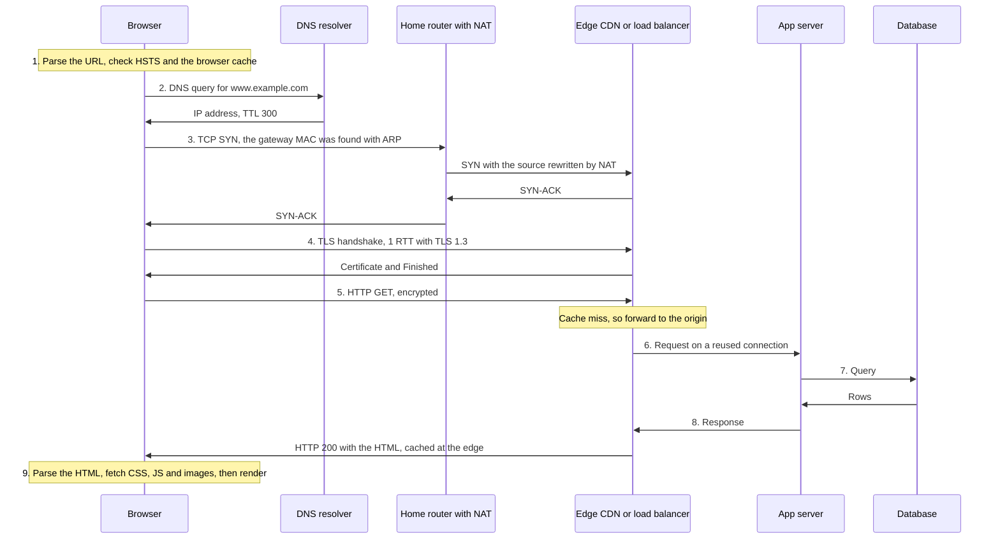
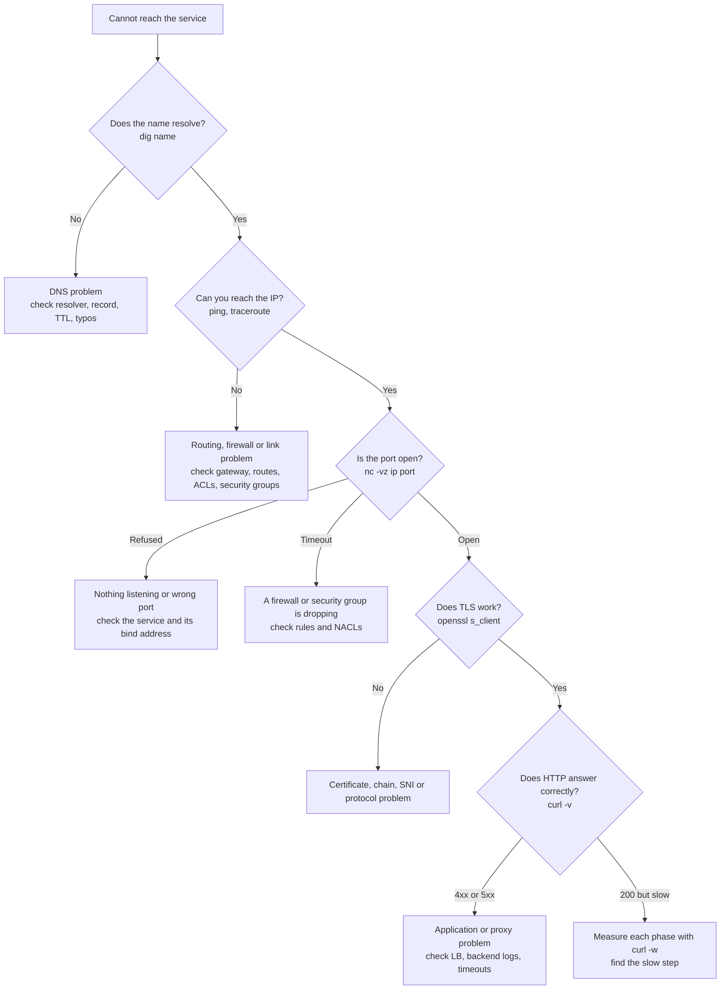
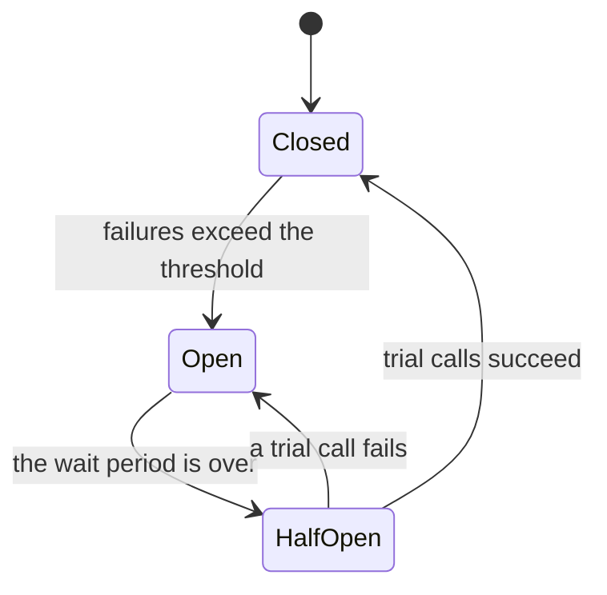

# Module 6: Networking for System Design Interviews


**Previous:** [Module 5: Firewalls, NAT, VPNs & Load Balancing](computer-networks/networking-module-5-nat-firewalls-vpn-load-balancing.md)

**Format:** plain English, with Mermaid diagrams, worked estimates, and commands for Linux or macOS.

## How this module connects to Modules 1–5

You now know every piece separately: layers and packets (Module 1), addressing and routing (Module 2), TCP and UDP (Module 3), DNS, HTTP and TLS (Module 4), and NAT, firewalls, VPNs, load balancers and CDNs (Module 5). Interviews rarely ask about one piece in isolation. They ask you to **combine** them:

- "What happens when you type a URL and press Enter?"
- "Why is this page slow for users in India?"
- "Design the network path for a chat or video app."
- "Two services time out intermittently. How do you debug it?"

This module teaches you to answer those questions in an organized way.

## Words you will meet in this module

| Word                   | Simple meaning                                                                     |
| ---------------------- | ---------------------------------------------------------------------------------- |
| **Latency budget**     | How much time each step of a request may use.                                      |
| **p50 / p99 latency**  | The time that 50% / 99% of requests are faster than. p99 shows the slow tail.      |
| **QPS**                | Queries per second: how many requests arrive each second.                          |
| **Little's Law**       | Concurrent requests = arrival rate × average time in the system.                   |
| **Timeout**            | A limit on how long to wait before giving up.                                      |
| **Backoff and jitter** | Waiting longer between retries, with a random amount added.                        |
| **Circuit breaker**    | A switch that stops calling a failing service for a while.                         |
| **Idempotent**         | Safe to repeat: doing it twice has the same effect as once.                        |
| **Backpressure**       | A busy service telling callers to slow down.                                       |
| **Partition**          | A network failure that splits a system into groups that cannot talk to each other. |

## 6.1: What Happens When You Type a URL and Press Enter?

### The idea in plain words

This is the most famous networking interview question, because the full answer touches **every layer**. A good answer is not a memorized list. It is a **story** that follows one request from your keyboard to a server and back, mentioning each layer briefly, and then going deeper where the interviewer asks.

### The whole journey in one diagram



### The steps and where you learned them

| #   | #                                                                                                                                                                                    | What happens     | Layer | Module |
| --- | ------------------------------------------------------------------------------------------------------------------------------------------------------------------------------------ | ---------------- | ----- | ------ |
| 1   | The browser **parses the URL** (scheme, host, port, path). It checks its **HTTP cache**, and **HSTS** ("always use HTTPS for this site").                                            | Application      | 4     |
| 2   | **DNS:** browser cache, then OS cache and `hosts` file, then the **recursive resolver**, then root, TLD and authoritative servers if needed. Result: an IP address.                  | Application      | 4     |
| 3   | The OS compares the destination IP with its own subnet. It is **not local**, so the next hop is the **default gateway**. **ARP** finds the gateway's MAC address.                    | Network and Link | 1, 2  |
| 4   | The packet is put in a frame and sent over Wi-Fi or Ethernet. **Switches forward by MAC address.**                                                                                   | Link             | 1     |
| 5   | The **home router performs NAT** (rewrites the private source address and port) and forwards the packet. Each router **decreases the TTL** and forwards by **longest prefix match**. | Network          | 2, 5  |
| 6   | The packet crosses the ISP and the Internet (**BGP** decides the path between networks). **Anycast** or **GeoDNS** directs it to the nearest **CDN edge** or region.                 | Network          | 2, 5  |
| 7   | **TCP three-way handshake** (SYN, SYN-ACK, ACK). 1 RTT. (With HTTP/3, QUIC replaces this.)                                                                                           | Transport        | 3     |
| 8   | **TLS handshake:** SNI, certificate check, key exchange. 1 more RTT with TLS 1.3.                                                                                                    | Application      | 4     |
| 9   | The browser sends the **HTTP request** (over HTTP/2 or HTTP/3).                                                                                                                      | Application      | 4     |
| 10  | At the edge: **firewall and WAF**, **CDN cache** check, then an **L4 load balancer**, then an **L7 proxy** (which may terminate TLS) chooses a backend.                              | 3 to 7           | 5     |
| 11  | The **app server** runs the code, which may read a **cache** and a **database**.                                                                                                     | Application      | n/a   |
| 12  | The **response** travels back. TCP slow start, flow control and congestion control govern the speed.                                                                                 | Transport        | 3     |
| 13  | The browser **parses the HTML**, finds more resources (CSS, JS, images), and fetches them over the **same connection** (HTTP/2) or new ones. Then it renders the page.               | Application      | 4     |

### The latency bill

The same request, with a faraway origin and with a nearby CDN edge (cold start: nothing cached, no connection yet):

| Step                                             | Far origin (RTT = 150 ms) | Nearby edge (RTT = 15 ms)  |
| ------------------------------------------------ | ------------------------- | -------------------------- |
| DNS (resolver is close, answer uncached)         | ~20 ms                    | ~20 ms                     |
| TCP handshake (1 RTT)                            | 150 ms                    | 15 ms                      |
| TLS 1.3 handshake (1 RTT)                        | 150 ms                    | 15 ms                      |
| HTTP request to first byte (1 RTT + server time) | 150 + 50 = 200 ms         | 15 + 5 = 20 ms (cache hit) |
| **Time to first byte**                           | **~520 ms**               | **~70 ms**                 |

Almost all of the difference comes from **RTT multiplied by the number of round trips**. This is why the standard fixes are: **fewer round trips** (HTTP/2, HTTP/3, TLS 1.3, connection reuse, 0-RTT) and **shorter round trips** (CDN, regional deployments).

### Interview traps

- Reciting steps without **numbers or reasons**. A strong answer says "DNS costs about 1 RTT if uncached, TCP 1, TLS 1."
- Forgetting the **local** steps: the subnet check, the **default gateway**, and **ARP**.
- Forgetting that **NAT** rewrites addresses, and that **MAC addresses change at each hop** (Module 1).
- Saying "the packet goes straight to the server." It crosses many routers, and often a **CDN, load balancer and reverse proxy** before the app.
- Treating it as one request. A real page needs **dozens of requests**, and connection reuse matters.

### Tricky questions and answers

#### Q1 [SDE-1/2]: What happens when you type `https://www.example.com` in a browser?

**Answer (a good outline):** The browser parses the URL and checks its caches and HSTS. It resolves the name with **DNS** (caches first, then the resolver walks root, TLD and authoritative servers) and gets an IP. Because the IP is not in the local subnet, the OS sends the packet to the **default gateway**, using **ARP** to find its MAC. The packet passes through **NAT** and many **routers** (longest prefix match, BGP between networks) to a nearby **CDN edge or load balancer**. The browser performs the **TCP three-way handshake**, then the **TLS handshake** (certificate check, key exchange). It sends the **HTTP request**. The edge may answer from cache, or the **load balancer** forwards it to an app server, which may call a **cache and database**. The response returns, the browser **parses the HTML**, fetches more resources (reusing connections), and **renders** the page. Then add the numbers: about 1 RTT each for DNS, TCP, TLS and the request.

#### Q2 [SDE-2/3]: Which parts of this process can you speed up, and how?

**Answer:** **DNS:** caching, longer TTLs for stable records, `dns-prefetch`. **TCP and TLS:** **connection reuse** (keep-alive, HTTP/2), **TLS 1.3** and **session resumption**, or **HTTP/3**, which combines the handshakes (and allows 0-RTT). **Distance:** a **CDN** or regional servers (shorter RTT shortens every step). **The request itself:** HTTP caching headers, compression, smaller payloads. **Server time:** caches, database tuning. Measure first with `curl -w` timing (Module 4), so that you fix the largest slice.

#### Q3 [SDE-3]: The same URL is opened by a user who is already connected to the site. What is different?

**Answer:** Most of the cost disappears. **DNS** is cached. The **TCP and TLS connection is reused** (HTTP keep-alive or HTTP/2), so there is no handshake and no slow start from scratch (the congestion window is already grown). The browser may serve resources from its **HTTP cache** with no request at all, or send a cheap **conditional request** and receive a **304**. So the request costs roughly **1 RTT plus server time**, or nothing.

## 6.2: Numbers Every Engineer Should Know

### The idea in plain words

In a system design interview, you often must **estimate**: how much bandwidth, how many servers, how long a transfer takes. You do not need exact values. You need **good orders of magnitude** and a clear method. This topic gives you both.

### Latency (round-trip time, approximate)

| Path                                | Typical RTT             |
| ----------------------------------- | ----------------------- |
| Same machine (loopback)             | < 0.1 ms                |
| Same rack or same availability zone | 0.1 – 0.5 ms            |
| Between zones in one region         | 1 – 2 ms                |
| Within one city                     | 1 – 5 ms                |
| US East to US West                  | 60 – 80 ms              |
| New York to London                  | 70 – 80 ms              |
| US West to Tokyo                    | 100 – 130 ms            |
| Europe or US to India               | 150 – 250 ms            |
| Mobile 4G / 5G to a nearby server   | 30 – 60 ms / 10 – 30 ms |
| Geostationary satellite             | ~ 600 ms                |
| Low-earth-orbit satellite           | 25 – 60 ms              |

These vary a lot with the route and the load. Use them as a rough guide, and say so.

**The physics rule:** a signal in fiber travels about **200,000 km/s**, so it takes about **5 µs per km one way**. Therefore:

```
1,000 km of cable  =  5 ms one way  =  10 ms round trip   (the absolute minimum)
Real routes are longer than a straight line, often 1.5× to 2×.
```

Example: New York to London is about 5,600 km. The physical minimum RTT is about 56 ms. Real RTT is 70–80 ms. **No amount of money can beat the speed of light**, so the only fix for distance is to **move the data closer**.

### Bandwidth and throughput

| Link     | Bits per second | Bytes per second (÷ 8) |
| -------- | --------------- | ---------------------- |
| 100 Mbps | 100,000,000     | 12.5 MB/s              |
| 1 Gbps   | 1,000,000,000   | 125 MB/s               |
| 10 Gbps  | 10,000,000,000  | 1.25 GB/s              |
| 100 Gbps | 100,000,000,000 | 12.5 GB/s              |

**Always convert carefully:** network speeds use **bits** (b), file sizes use **bytes** (B). 1 byte = 8 bits. A fast SSD can read about 3 GB/s (24 Gbps), so a 10 Gbps network card can be the **bottleneck** when serving files from disk.

### Handy formulas

```
Bandwidth needed       = requests per second × size per response × 8   (in bits per second)
Transfer time          = data size ÷ throughput
Concurrent requests    = arrival rate × average time in system         (Little's Law)
TCP window limit       = window ÷ RTT                                  (Module 3)
Bandwidth-delay product = bandwidth × RTT                              (Module 1)
```

### Worked estimates

**1. Image service.** 10,000 requests per second, each returning a 200 KB image.

- Bandwidth = 10,000 × 200 KB = 2,000,000 KB/s = **2 GB/s = 16 Gbps**.
- That needs several 10 Gbps links, or (better) a **CDN** so most traffic never reaches your data center.

**2. Large transfer.** Copy 1 TB over a 1 Gbps link.

- 1 TB = 8 × 10¹² bits. Time = 8 × 10¹² ÷ 10⁹ = **8,000 s ≈ 2.2 hours** (with perfect use of the link).
- Over a 10 Gbps link: about 13 minutes. This is why very large datasets are sometimes shipped on **physical disks**.

**3. Concurrent connections (Little's Law).** 20,000 requests per second, each taking 150 ms on average.

- Concurrent requests = 20,000 × 0.15 = **3,000** in flight at any moment. Use this to size thread pools, connection pools and file descriptors.

**4. Chat app.** 10 million users online, each with one WebSocket connection.

- A tuned server can hold on the order of **100,000** idle connections (limited by memory and file descriptors).
- Servers needed ≈ 10,000,000 ÷ 100,000 = **100 servers**, plus headroom (say 150 for failures and spikes).
- Memory per connection (a few KB to tens of KB, including buffers) means about **tens to hundreds of GB** in total.

### Rules of thumb

- A single well-tuned server can hold **tens of thousands to a million idle connections** (the "C10K to C10M" problem is about memory and file descriptors, not ports).
- **TLS handshakes cost CPU**, and **ECDSA certificates are much cheaper** for the server than RSA ones. Session resumption avoids repeating the work.
- **Latency is dominated by round trips**, so reducing the **number of sequential round trips** is usually worth more than reducing payload size.
- **p99 matters more than the average** for user experience, because a page that needs 50 backend calls will hit the slow tail on almost every load.
- Network calls between services are **thousands of times slower** than memory access, so avoid unnecessary calls ("chatty" APIs).

### Interview traps

- Mixing **bits and bytes** (Mbps vs MB/s). It makes estimates wrong by 8×.
- Using **average** latency when the problem is the tail (p99).
- Forgetting that **distance sets a floor** on latency that bandwidth cannot reduce.
- Reporting a **precise number** with false confidence. Say "roughly," show the arithmetic, and state your assumptions.
- Counting only **peak bandwidth to clients**, and forgetting **internal traffic** (replication, backups, service-to-service calls, cross-zone data transfer costs).

### Tricky questions and answers

#### Q1 [SDE-2]: A service must stream video to 1 million concurrent viewers at 5 Mbps each. How much bandwidth is that, and how would you serve it?

**Answer:** 1,000,000 × 5 Mbps = **5,000,000 Mbps = 5 Tbps**. No single data center link provides that. You must use a **CDN** (and often ISP-embedded caches) so that video is served from **edge servers near viewers**, with **adaptive bitrate streaming** (HLS or DASH, over HTTP with small chunks), and an **origin shield** to protect the origin. The origin serves each chunk only once per region, rather than a million times.

#### Q2 [SDE-2/3]: What throughput can a single TCP connection reach at 1% packet loss, with a 50 ms RTT and 1460-byte segments?

**Answer:** Use the **Mathis formula**: throughput ≈ (MSS ÷ RTT) × (1.22 ÷ √p). Here MSS = 1460 bytes = 11,680 bits, RTT = 0.05 s, p = 0.01. That gives (11,680 ÷ 0.05) × (1.22 ÷ 0.1) = 233,600 × 12.2 ≈ **2.85 Mbps**, even on a 1 Gbps link. Loss hits TCP hard because it treats loss as congestion and shrinks its window (Module 3). Fixes: reduce the loss, use **BBR** (it does not shrink on random loss), open **parallel connections**, or use a protocol such as **QUIC** with tuned congestion control.

#### Q3 [SDE-3]: Estimate the bandwidth and the number of servers for an API with 50,000 requests per second, an average 20 KB response, and 80 ms average service time.

**Answer:** **Bandwidth:** 50,000 × 20 KB = 1,000,000 KB/s = 1 GB/s = **8 Gbps** of response traffic (plus requests, usually much smaller). **Concurrency (Little's Law):** 50,000 × 0.08 = **4,000** requests in flight. If one server comfortably handles about 500 concurrent requests, I need about 8 servers for the load, and more for **headroom (say 2×, to survive a failure and spikes)**, so around **16**. The 8 Gbps also suggests **multiple 10 Gbps load-balancer links**, or terminating at a managed cloud load balancer, and compressing responses to cut bandwidth. I would state the assumptions and say I would confirm them by load testing.

## 6.3: Troubleshooting the Network, Layer by Layer

### The idea in plain words

When something is broken, panic and guessing waste time. Experts use a **method**: test one layer at a time, from the bottom up (or from the user's symptom down), and each test **rules out** a whole set of causes. The layered model from Module 1 is a troubleshooting map.

### The method



Good habits: **change one thing at a time**, **write down** what you tested and the result, check **recent changes** first (deploys, config, certificates, firewall rules), and test from **both ends** (client and server).

### The tools, by layer

| Layer      | Question                                                             | Tools                                                      |
| ---------- | -------------------------------------------------------------------- | ---------------------------------------------------------- |
| Link       | Is the cable or Wi-Fi up? Right speed?                               | `ip link`, `ethtool`, the NIC lights                       |
| Network    | Do I have an IP, a gateway and a route? Can I reach the destination? | `ip addr`, `ip route`, `ping`, `traceroute`, `mtr`         |
| DNS        | Does the name resolve to the right IP?                               | `dig`, `nslookup`, `resolvectl`                            |
| Transport  | Is the port open? Are there resets or retransmits?                   | `nc -vz`, `ss -tan`, `ss -ti`, `netstat -s`, `tcpdump`     |
| TLS        | Is the certificate valid and the chain complete?                     | `openssl s_client`, `curl -v`                              |
| HTTP       | What did the server say, and how long did each phase take?           | `curl -v`, `curl -w`, browser developer tools, server logs |
| Everything | What is really on the wire?                                          | `tcpdump`, **Wireshark**                                   |

`mtr` combines `ping` and `traceroute` and shows **loss and latency per hop** over time. Loss that appears at one middle hop but **not at later hops** is normally just a router that **rate-limits ICMP replies**, not real loss. Real loss shows up from some hop **onward to the end**.

### Reading error messages

| What you see                                 | What it usually means                                                                                                           |
| -------------------------------------------- | ------------------------------------------------------------------------------------------------------------------------------- |
| `Name or service not known`, `NXDOMAIN`      | **DNS** cannot resolve the name                                                                                                 |
| `Network is unreachable`, `No route to host` | No **route** in the table, or the local network cannot find the host (ARP failure)                                              |
| `Connection refused`                         | The host answered with a **TCP RST**: it is up, but **nothing listens** on that port (or a firewall REJECTs)                    |
| `Connection timed out`                       | Packets are **silently dropped** (firewall, security group, route problem, or a dead host)                                      |
| `Connection reset by peer`                   | The other side (or a middlebox) sent a **RST**: a crash, a closed socket, or an **idle timeout** on a load balancer or firewall |
| `SSL certificate problem`                    | Expired, wrong hostname, **missing intermediate**, untrusted CA, or a wrong clock                                               |
| `502` / `503` / `504`                        | Bad response from upstream / overloaded or down / upstream timed out (Module 4)                                                 |

**Refused vs. timed out is the most useful clue**: _refused_ means you **reached** the host, and _timed out_ means the packets **never got an answer** (usually a firewall).

### Common causes of "weird" problems

| Symptom                                                | Things to check                                                                                                                                                    |
| ------------------------------------------------------ | ------------------------------------------------------------------------------------------------------------------------------------------------------------------ |
| Works for some users or networks only                  | **DNS caching or geo-DNS**, an **IPv6 vs. IPv4** difference, an **MTU** problem, a bad **ISP route**, different firewall rules                                     |
| Small requests work, large ones hang                   | **MTU and PMTUD black hole** (Module 2): blocked ICMP, a VPN with a lower MTU                                                                                      |
| Works for a while, then intermittent timeouts          | **Port exhaustion**, a full **NAT or conntrack table**, **idle timeouts** closing connections, **keep-alive mismatches** (Module 5), a growing **TIME_WAIT** count |
| Slow only under load                                   | **Queuing**, **congestion**, **connection pool** limits, **retransmissions** (`ss -ti`, `netstat -s`), CPU saturation                                              |
| Works by IP but not by name                            | **DNS**                                                                                                                                                            |
| Works from your laptop but not from the server         | A different **route, firewall, security group, proxy setting, DNS resolver** or **NAT**                                                                            |
| Fine for hours, then fails after a certificate renewal | **Chain** or **SNI** problem, or an expired certificate                                                                                                            |

### A little packet-capture skill

```
## Capture traffic to one host and port, save it, then open it in Wireshark
sudo tcpdump -i any -nn host 10.0.0.5 and port 443 -w capture.pcap
```

Useful Wireshark display filters:

| Filter                        | Shows                                            |
| ----------------------------- | ------------------------------------------------ |
| `tcp.analysis.retransmission` | Retransmitted segments (packet loss)             |
| `tcp.flags.reset == 1`        | Resets (who closed the connection?)              |
| `tcp.analysis.zero_window`    | A receiver that is overloaded                    |
| `dns`                         | DNS queries and answers                          |
| `tls.handshake`               | TLS handshakes (look at the SNI and certificate) |
| `http2` or `quic`             | Modern HTTP traffic                              |

Look at **who sent the first RST or FIN**, **how long the gaps are** (a 200 ms or 1 s gap often means a timer, such as a retransmission timeout or delayed ACK), and whether **the same packet repeats**.

### Interview traps

- **Guessing instead of isolating.** Interviewers want a **systematic method**, not a list of random commands.
- Treating "ping fails" as "the host is down." ICMP may be **blocked** while the service works (Module 2).
- Trusting a single hop's loss in `mtr` (ICMP rate limiting).
- Forgetting **both directions**: the return path can be broken (asymmetric routing, a stateless ACL without return rules).
- Ignoring **recent changes**. Most outages follow a change.

### Tricky questions and answers

#### Q1 [SDE-2]: "I get connection refused" versus "connection timed out." What does each tell you?

**Answer:** **Refused** means the SYN reached a machine that answered with a **RST**: the network path and the host work, but **nothing is listening** on that port (the service is down, the wrong port, or it listens only on `127.0.0.1`). **Timed out** means **no answer at all**: a firewall or security group is **dropping** the packets, the route is wrong, or the host is down. So refused points to the **service**, and timed out points to the **path or firewall**.

#### Q2 [SDE-2/3]: Two microservices see random timeouts every few minutes, but CPU and memory look fine. How do you investigate?

**Answer:** Work from the network inward. (1) Check **connection handling**: are connections reused, or opened per request (port exhaustion, TIME_WAIT)? (2) Check for **idle-timeout mismatches**: a load balancer, NAT or firewall closing idle connections that the client later reuses (this gives resets and timeouts). (3) Look at **TCP health** with `ss -ti` and `netstat -s`: retransmits, resets and the retransmission timeout. (4) Check **DNS**: stale cached addresses after a deployment, or slow lookups. (5) Check the **NAT or conntrack table** for being full. (6) Look for **MTU issues** with a size-sweeping ping. (7) Take a **packet capture** at the client and server and compare: are packets lost in between, or does the server not answer in time? Then fix the cause: connection pooling and keep-alive settings, timeouts that match across layers, and retries with backoff.

#### Q3 [SDE-3]: A user in another country says your site is "slow." You cannot reproduce it. What do you do?

**Answer:** Gather evidence before guessing. Ask for the **exact URL, time, and a HAR file or browser timing**. Reproduce from **that region** (a cloud VM or synthetic monitoring there) and run `curl -w` timing, `mtr` and `dig` to see **which phase is slow**: DNS, TCP connect, TLS, time to first byte, or download. A long connect time points to **distance or routing** (fix: CDN, regional deployment, better peering). A long TLS time points to too many round trips (TLS 1.3, resumption, edge termination). A long first-byte time with fast connect points to a **slow origin or cache miss**. A slow download with high loss points to **congestion control and loss** (BBR, HTTP/3). Then verify the fix with the same measurement from the same region.

## 6.4: Network Design Patterns for Resilient Systems

### The idea in plain words

Networks fail in ways that CPUs and memory do not: packets are delayed, lost, duplicated, reordered, or the network **splits in two**. A system that behaves well must **expect** this. The classic list of wrong assumptions is called the **Fallacies of Distributed Computing**:

| The fallacy                | The reality                                                |
| -------------------------- | ---------------------------------------------------------- |
| The network is reliable    | Packets get lost, connections drop                         |
| Latency is zero            | Every call costs milliseconds, and the tail is long        |
| Bandwidth is infinite      | Links saturate, and data transfer has a cost               |
| The network is secure      | Anyone on the path may listen or tamper (use TLS)          |
| Topology does not change   | Servers, routes and addresses change constantly            |
| There is one administrator | Many teams and companies share the path                    |
| Transport cost is zero     | Serialization, bandwidth and cross-zone traffic cost money |
| The network is homogeneous | Different links, MTUs and software mix                     |

### The core toolbox

#### Timeouts everywhere

Every network call needs a **timeout**. Without one, a slow dependency can hold threads and connections forever and spread the failure. Use a short **connect timeout** and a **read timeout** based on the dependency's p99. Pass a **deadline** down the call chain, so a downstream service does not keep working on a request the user has already abandoned.

#### Retries, done carefully

- Retry only **idempotent** operations (or use **idempotency keys**, Module 4).
- Use **exponential backoff with jitter**: `delay = random(0, min(cap, base × 2^attempt))`. The randomness stops all clients retrying at the same moment.
- Cap the number of attempts and use a **retry budget** (for example, retries may be at most 10% of traffic).
- **Retries multiply.** If 3 layers each make up to 3 attempts, one user request can turn into up to **27 calls** to the bottom service, which can turn a small problem into an outage (a **retry storm**).

#### Circuit breaker

If a dependency keeps failing, **stop calling it for a while** instead of piling on, and fail fast (or return a fallback).



- **Closed:** normal, calls pass through.
- **Open:** calls fail immediately, the dependency gets time to recover.
- **Half-open:** a few trial calls test whether it has recovered.

#### Connection reuse and multiplexing

Opening connections is expensive (TCP, TLS, slow start). Use **keep-alive**, **connection pools** and **HTTP/2 or gRPC multiplexing**. Size pools with **Little's Law** (Topic 6.2). Make sure **idle timeouts match** across the client, the load balancer and the server (Module 5).

#### Load shedding, backpressure and rate limiting

When overloaded, **reject excess work early** (a fast `429` or `503`) instead of slowing down for everyone. Apply **rate limits** per client (token bucket), propagate **backpressure** (tell callers to slow down), and prioritize important traffic. A system that accepts everything and dies is worse than one that refuses some and survives.

#### Reducing round trips and distance

- **Batching:** one call with 100 items, not 100 calls.
- **Caching** at several levels: the client, a **CDN**, an in-memory cache, and the database.
- **Compression** and compact formats (Protocol Buffers).
- **Regional deployment** and **data locality**: keep the data near the users, and be honest about the **replication lag** between regions.
- **Hedged requests:** send a second request to another replica if the first has not answered after the p95 time, and take the first reply (for idempotent reads only). It cuts the **tail** latency.

#### Health, discovery and failover

**Health checks**, **service discovery** (DNS, a registry, or a **service mesh** that handles retries, timeouts and mTLS for you), **graceful degradation** (a page that still works without recommendations), and tested **failover** (Module 5).

#### Network partitions

A **partition** splits your system into groups that cannot talk. Partitions **will** happen, so for stateful systems you must choose what to do while the network is split: remain **consistent** (refuse some requests) or stay **available** (accept requests and reconcile later). This is the practical meaning of the **CAP theorem**.

### Choosing a protocol

| Need                                                   | A good choice                                                      |
| ------------------------------------------------------ | ------------------------------------------------------------------ |
| A public API for many kinds of clients                 | **REST over HTTPS** (HTTP/2 or HTTP/3)                             |
| Internal service-to-service calls, typed, low overhead | **gRPC** (HTTP/2, Protocol Buffers)                                |
| Clients choose exactly which fields they want          | **GraphQL**                                                        |
| Two-way real-time messaging                            | **WebSocket**                                                      |
| One-way server push (notifications, feeds)             | **Server-Sent Events**                                             |
| Real-time voice, video, games                          | **UDP-based**: WebRTC, QUIC, or a custom protocol                  |
| Decouple producers and consumers, absorb bursts        | A **message queue or log** (Kafka, SQS, RabbitMQ)                  |
| Bulk transfer across regions                           | **TCP with tuned buffers and BBR**, or a specialized transfer tool |

### How to talk about networking in a system design interview

1. **Who are the clients and where are they?** (This decides CDN and regions.)
2. **Which protocol, and why?** (REST, gRPC, WebSocket, UDP.)
3. **The path in:** DNS or anycast, CDN, firewall or WAF, L4 and L7 load balancers, services.
4. **Where does TLS terminate?** (Edge only, or end to end, or mTLS inside.)
5. **Numbers:** QPS, bandwidth, concurrent connections, p99 targets.
6. **Failure handling:** timeouts, retries with backoff, circuit breakers, health checks, failover.
7. **Data locality and replication latency** between regions.
8. **Security:** network zones, least privilege, rate limits, DDoS protection.
9. **Observability:** latency percentiles, error rates, retransmits and resets, distributed tracing.
10. **Trade-offs:** say what you gave up, and what you would change at 10× scale.

### Interview traps

- "Just add retries." Without backoff, jitter, budgets and idempotency, retries **cause** outages.
- No **timeouts**, or timeouts that are **longer at the bottom than at the top** (the caller gives up while the callee keeps working).
- **Sticky or stateful** designs that fail badly when a server or region disappears.
- Designing for the **happy path only**. Always say what happens when a link, a zone or a dependency fails.
- Putting a **single load balancer or NAT gateway** in the path without addressing availability.

### Tricky questions and answers

#### Q1 [SDE-2]: Service A calls B, which calls C. C becomes slow. What happens, and how do you protect the system?

**Answer:** Without protection, B's threads and connections wait on C until they are all used up, so B becomes unresponsive, then A's calls to B pile up and A fails too (a **cascading failure**). Protect with **timeouts** at every hop (shorter as you go deeper), **circuit breakers** so B stops calling a failing C, **bulkheads** (separate connection pools or thread pools per dependency), **load shedding** and **fallbacks** (cached or default data), and **retry limits with backoff**. Also monitor p99 latency so the slowdown is caught early.

#### Q2 [SDE-2/3]: Why do retries sometimes make an outage worse, and how do you retry safely?

**Answer:** When a service is struggling, **every client retries**, so the load on it **multiplies**, and across layers the multiplication compounds (3 layers × 3 attempts = 27×). The extra load prevents recovery, and synchronized retries arrive in waves (a **thundering herd**). Retry safely by: retrying only **idempotent** calls (or using idempotency keys), using **exponential backoff with jitter**, **limiting attempts** and using a **retry budget**, retrying at **one layer only**, honoring `Retry-After` and `429`, and combining it with **circuit breakers**.

#### Q3 [SDE-3]: Design the networking for a global chat application with 10 million concurrent users.

**Answer:** **Protocol:** **WebSocket** over TLS for two-way messaging (with a fallback to long polling or SSE), and HTTP for the rest of the API. **Entry:** **GeoDNS or anycast** sends users to the nearest region. An **L4 load balancer** spreads connections across a fleet of **connection (gateway) servers**, using **least connections** since connections last for hours. **Capacity:** about 100,000 connections per server gives about 100 servers, so I would run about 150 with headroom, spread over several zones. **Message routing:** a connection server does not know where the recipient is, so it publishes to a **pub/sub layer** (Redis or Kafka) keyed by user or chat room, and the server holding the recipient's connection delivers it. **Reliability:** **heartbeats** to detect dead connections, **idle timeouts** configured to match the load balancer, **clients reconnecting with backoff and jitter** to avoid a thundering herd after an outage, message **IDs and acknowledgments** for at-least-once delivery with deduplication, and a database for history. **Security:** TLS, token authentication on the upgrade request, rate limits, and DDoS protection at the edge.

## 6.5: Mock Interview Bank

### Rapid-fire questions (short answers, as in a real round)

**1. TCP vs. UDP?**
TCP is connection-oriented, reliable, ordered, with flow and congestion control, and is a byte stream. UDP is connectionless, unreliable and unordered, but light and low-latency, and keeps message boundaries.

**2. What is the difference between MTU and MSS?**
**MTU** is the largest packet a link carries (1500 bytes on Ethernet). **MSS** is the largest TCP data in one segment, usually MTU − 20 (IP) − 20 (TCP) = **1460**.

**3. What do ARP and DHCP do?**
**ARP** finds the MAC address for an IPv4 address on the local link. **DHCP** hands out an IP address, mask, gateway, DNS servers and a lease (Discover, Offer, Request, Acknowledge).

**4. Hub vs. switch vs. router?**
A hub repeats to every port (Layer 1). A switch forwards by MAC address and learns where devices are (Layer 2). A router forwards between networks by IP address using a routing table (Layer 3).

**5. How many usable hosts are in a `/27`?**
32 − 27 = 5 host bits, 2⁵ − 2 = **30**.

**6. What is a default gateway?**
The router a host sends traffic to when the destination is **not in its own subnet**.

**7. What is NAT, and is it a firewall?**
NAT rewrites addresses (and, with PAT, ports) so many private hosts share a public IP. It is **not** a firewall, though it blocks unsolicited inbound traffic as a side effect.

**8. What does a DNS TTL control?**
How long resolvers and clients may **cache** an answer. Changes spread only as old cached answers expire.

**9. 301 vs. 302, and 401 vs. 403?**
**301** is a permanent redirect, **302** a temporary one. **401** means "not authenticated," **403** means "authenticated but not allowed."

**10. What does TLS provide?**
**Confidentiality** (encryption), **integrity** (tamper detection) and **authentication** (certificates). It uses asymmetric cryptography to agree on a key and symmetric cryptography for the data.

**11. What is TIME_WAIT?**
A state on the side that closed a TCP connection first, lasting about 60 s on Linux. It protects against old duplicate segments and lets the last ACK be resent.

**12. What is the difference between latency, bandwidth and throughput?**
Latency is how long one piece of data takes. Bandwidth is the link's capacity. Throughput is the rate actually achieved.

**13. L4 vs. L7 load balancer?**
L4 balances connections by IP and port, and is fast. L7 reads HTTP, so it can route by URL or header, terminate TLS, and retry.

**14. What is anycast?**
The same IP announced from many places. BGP routes each user to the nearest one. Used by CDNs, DNS and DDoS protection.

**15. Why does HTTP/3 use UDP?**
To avoid TCP head-of-line blocking and to be deployable in user space. QUIC adds its own reliability, ordering per stream, congestion control and TLS 1.3 on top of UDP.

**16. What is CORS?**
A browser-enforced rule about which web origins may call an API. The server only sends `Access-Control-Allow-*` headers, and tools like `curl` are not affected.

**17. What does `traceroute` use to find routers?**
Probes with increasing **TTL**. Each router that drops a TTL=0 packet replies with ICMP "time exceeded."

**18. What happens if you connect to a closed TCP port, and to a closed UDP port?**
TCP: the host replies with a **RST** (connection refused). UDP: the host replies with an **ICMP port unreachable** (if allowed).

**19. What is a VPN?**
An encrypted tunnel that wraps whole packets inside outer packets, so two networks or a device and a network act as if they were directly connected.

**20. Which ports go with HTTPS, SSH, DNS, SMTP and MySQL?**
443, 22, 53 (UDP and TCP), 25 (587 for clients), and 3306.

### Scenario questions (longer, with a model approach)

**S1. "Our checkout page is fast in the US but takes 6 seconds in India. Why, and what do you do?"**
Measure from India with `curl -w`: which phase is slow? If TCP connect and TLS dominate, the cause is **RTT and the number of round trips** (distance). Fixes: a **CDN** and edge TLS termination, **regional deployment**, **HTTP/2 or HTTP/3**, **TLS 1.3**, connection reuse, and fewer sequential API calls (batching). If time to first byte is long with a quick connect, the origin or the cache is the problem. If download is slow with loss, consider BBR or HTTP/3. Verify with the same measurement afterward.

**S2. "Design the network path for a global video streaming service."**
Use a **CDN with caches inside ISP networks**, **adaptive bitrate streaming** (HLS/DASH: small HTTP chunks at several qualities), an **origin shield**, and **anycast or DNS steering** to the nearest edge. Estimate the traffic (5 Mbps × 1 million viewers = 5 Tbps) to show why caching at the edge is mandatory. Mention **TLS at the edge**, **HTTP/2 or QUIC** to reduce round trips and head-of-line blocking, popular content **pre-positioned** during off-peak hours, and monitoring of rebuffering and p99 chunk latency.

**S3. "Intermittent `connection reset` errors between a client service and an API behind a load balancer."**
Suspect **idle-timeout mismatch** (a load balancer or NAT closing idle connections that the client reuses), then **backend restarts without connection draining**, **conntrack or NAT table exhaustion**, **keep-alive settings**, and **MTU problems** with larger payloads. Capture packets and find **who sent the first RST** and how long the connection had been idle. Fix by making keep-alive and idle timeouts consistent (the backend's longer than the load balancer's), enabling TCP keepalives or application heartbeats, and adding retries for idempotent calls.

**S4. "A 1 Gbps transatlantic link only transfers at a few Mbps. Why?"**
Two usual causes. **Window limits:** throughput ≤ window ÷ RTT (a 64 KB window at 80 ms gives about 6.5 Mbps), so the window must reach the **bandwidth-delay product** (10 MB for 1 Gbps at 80 ms), with window scaling and large buffers. **Packet loss:** even 0.1–1% loss limits TCP badly (the Mathis formula), so reduce loss, use **BBR**, parallel streams, or a UDP-based transfer protocol.

**S5. "Design a URL shortener's networking."**
Short links are **read-heavy and cacheable**. Use a **CDN** and an in-memory cache so most redirects never reach the origin, with `301` or `302` chosen deliberately (`301` is cached more by browsers, so you lose analytics, and `302` keeps traffic visible to you). Entry through **anycast or GeoDNS**, an **L7 load balancer**, and stateless redirect servers. Keep **TLS** at the edge, add **rate limiting** and abuse protection against enumeration, and set short **timeouts** to the key-value store with a cache in front.

## Hands-On Lab: Trace and Measure a Whole Page Load

```
#1. dig +trace www.example.com                      # the DNS walk
#2. ip route get 93.184.216.34                      # which interface and gateway will be used
#3. mtr -rwc 20 www.example.com                     # path, latency and loss per hop
#4. nc -vz www.example.com 443                      # is the port reachable?
5. openssl s_client -connect www.example.com:443 -servername www.example.com </dev/null | head -30
6. curl -s -o /dev/null -w "dns %{time_namelookup}  tcp %{time_connect}  tls %{time_appconnect}  ttfb %{time_starttransfer}  total %{time_total}\n" https://www.example.com
7. curl --http2 -sI https://www.example.com | head -1   and   curl --http1.1 -sI https://www.example.com | head -1
#8. sudo tcpdump -i any -nn host www.example.com -c 40        # watch SYN, TLS and data
```

Questions to answer for yourself:

- From the `curl -w` numbers, which phase is the slowest for you? How many round trips does each phase use, and what is your RTT?
- Does `mtr` show loss only at one middle hop, or from some hop onward to the destination?
- Which TLS version and HTTP version did you get? What would change with HTTP/3?
- Pick any website, and write the 13-step story from Topic 6.1 using **your own measured numbers**.

## Module 6 Cheat Sheet

| Concept               | One-line interview answer                                                                                                     |
| --------------------- | ----------------------------------------------------------------------------------------------------------------------------- |
| URL to page           | URL parse, DNS, subnet check and gateway ARP, NAT and routing, TCP, TLS, HTTP, edge and load balancer, app, response, render. |
| Latency budget        | About 1 RTT each for DNS, TCP, TLS 1.3 and the request. Cut round trips and cut RTT (CDN).                                    |
| Distance floor        | About 5 µs per km one way. 1,000 km is at least 10 ms RTT. Bandwidth cannot beat it.                                          |
| Units                 | Network speeds are in bits, file sizes in bytes. Divide Mbps by 8 for MB/s.                                                   |
| Little's Law          | Concurrent requests = arrival rate × average time in system.                                                                  |
| Bandwidth estimate    | QPS × response size × 8.                                                                                                      |
| Transfer time         | Size ÷ throughput. 1 TB at 1 Gbps is about 2.2 hours.                                                                         |
| TCP window limit      | Throughput ≤ window ÷ RTT. Needs window ≥ BDP.                                                                                |
| Loss and TCP          | Throughput ≈ (MSS ÷ RTT) × 1.22 ÷ √p. 1% loss gives only a few Mbps at 50 ms RTT.                                             |
| Troubleshooting       | Isolate layer by layer: DNS, IP reachability, port, TLS, HTTP, then measure phases.                                           |
| Refused vs. timed out | Refused = reached the host, nothing listening. Timed out = dropped, often a firewall.                                         |
| `mtr` loss            | Loss at one middle hop only is ICMP rate limiting. Real loss continues to the end.                                            |
| Intermittent resets   | Idle-timeout mismatch, NAT or conntrack limits, backend restarts, MTU.                                                        |
| Timeouts              | On every call. Shorter as you go deeper. Propagate deadlines.                                                                 |
| Retries               | Idempotent only. Backoff with jitter, a budget, one layer. Beware 27× amplification.                                          |
| Circuit breaker       | Closed, open, half-open. Fail fast so a failing dependency can recover.                                                       |
| Resilience tools      | Bulkheads, load shedding, backpressure, rate limits, hedged requests, graceful degradation.                                   |
| Partitions            | They will happen. Choose consistency or availability during them.                                                             |
| Protocol choice       | REST public, gRPC internal, WebSocket or SSE for push, UDP for real-time media, queues to decouple.                           |

## The Whole Series in One Table

| Module                            | The one idea to remember                                                                                                             |
| --------------------------------- | ------------------------------------------------------------------------------------------------------------------------------------ |
| **1. Basics & Layers**            | Networks are built in layers. Each adds a header going down (encapsulation). Latency, bandwidth and throughput are different things. |
| **2. IP, Subnetting & Routing**   | IP addresses are hierarchical so routers can forward by prefix. Longest prefix match. MACs change per hop, IPs do not.               |
| **3. TCP & UDP**                  | Ports pick the program. TCP adds reliability with sequence numbers, ACKs, windows and congestion control. UDP adds almost nothing.   |
| **4. DNS, HTTP & TLS**            | Names become IPs through cached hierarchy. HTTP is stateless and cached. TLS gives confidentiality, integrity and authentication.    |
| **5. NAT, Firewalls, VPNs & LBs** | Middle boxes rewrite, filter, tunnel and spread traffic. L4 vs L7. CDNs and anycast bring content close and absorb attacks.          |
| **6. System Design**              | Count round trips, estimate with numbers, troubleshoot by layer, and design for failure with timeouts, backoff and circuit breakers. |

### Final checklist before your interview

- [ ] I can tell the full "type a URL" story, with numbers, in under three minutes.
- [ ] I can explain the OSI and TCP/IP layers, encapsulation, and which addresses change at each hop.
- [ ] I can do subnet math by hand: network, broadcast, usable hosts, VLSM, summarization.
- [ ] I can explain the TCP handshake, teardown, TIME_WAIT, loss recovery, flow control and congestion control.
- [ ] I can explain DNS resolution, caching and TTL, HTTP caching and methods, and the TLS 1.3 handshake.
- [ ] I can compare L4 and L7 load balancers, stateless and stateful firewalls, and NAT, VPNs and proxies.
- [ ] I can estimate bandwidth, concurrency and transfer times, and convert bits and bytes correctly.
- [ ] I can troubleshoot a "cannot connect" and a "slow" report by isolating one layer at a time.
- [ ] I mention **timeouts, retries with backoff, circuit breakers, and failure handling** unprompted in design answers.
- [ ] I state my **assumptions and trade-offs**, and say how I would verify the numbers.

### Suggested study plan

| Week | Focus           | Goal                                                                        |
| ---- | --------------- | --------------------------------------------------------------------------- |
| 1    | Modules 1 and 2 | Do the subnetting exercises until they are automatic.                       |
| 2    | Module 3        | Draw the handshake, teardown and congestion window from memory.             |
| 3    | Module 4        | Run the DNS, curl and openssl labs on three real sites.                     |
| 4    | Module 5        | Build the NGINX load balancer lab, and design a three-tier firewall layout. |
| 5    | Module 6        | Practice the URL story and the estimates out loud.                          |
| 6    | Mock interviews | Answer the scenario questions with a friend, in 10 minutes each.            |
