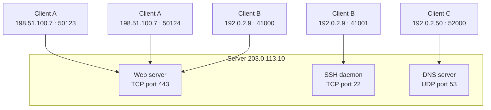
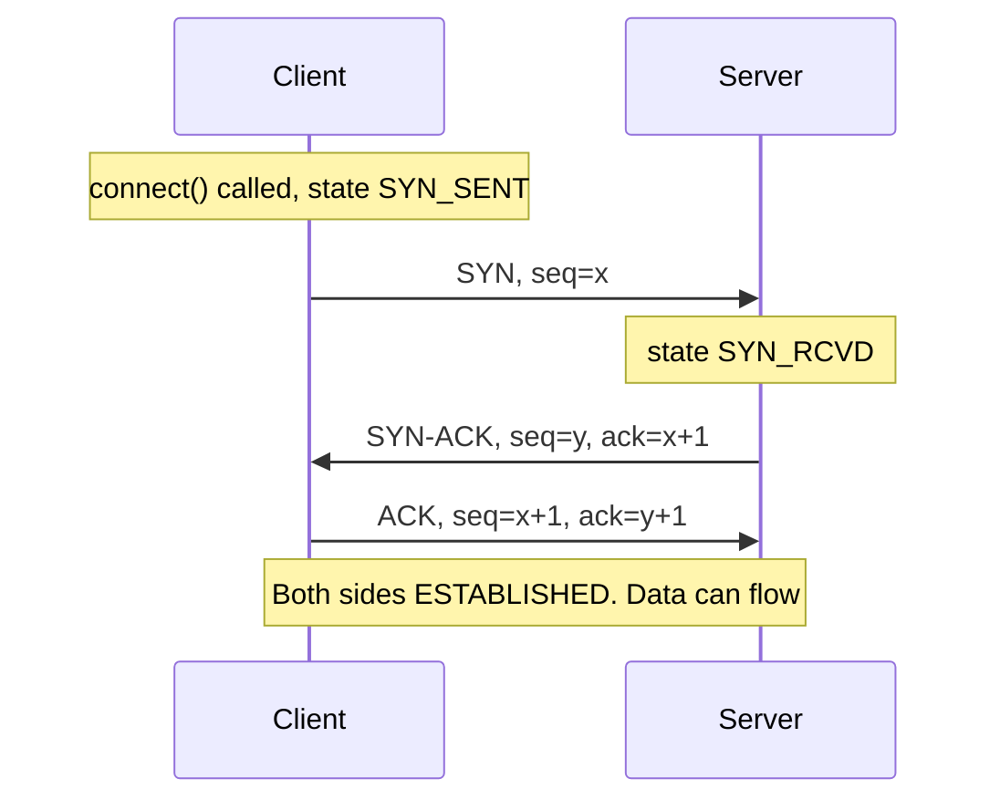
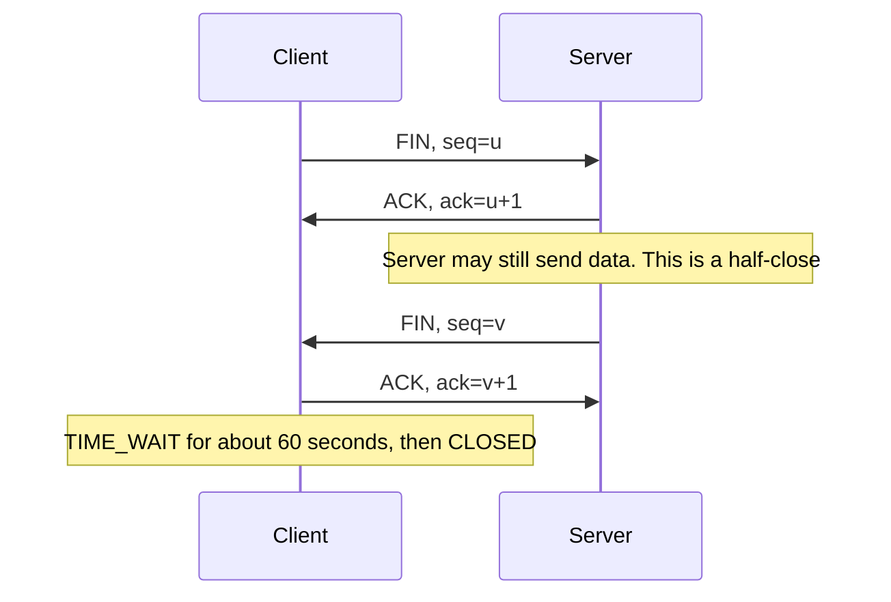
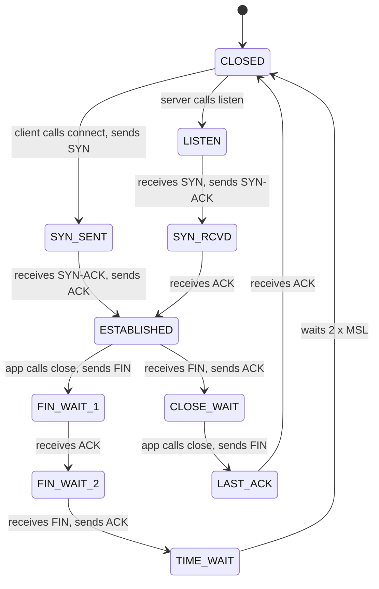
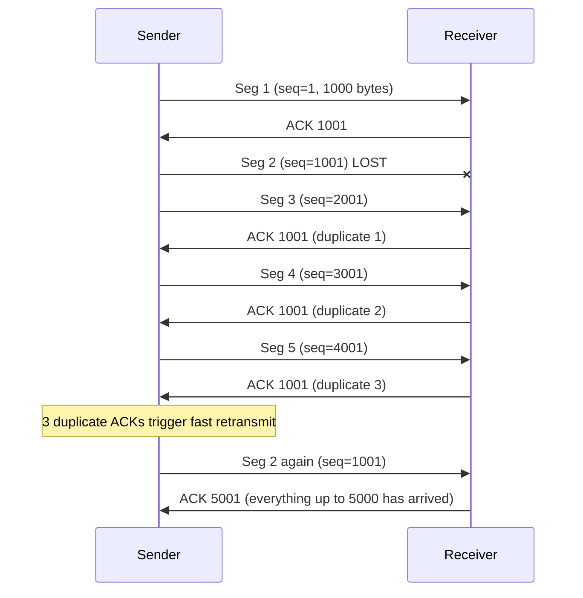
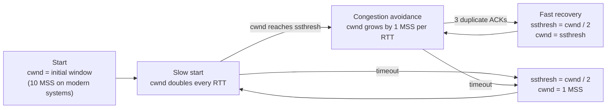
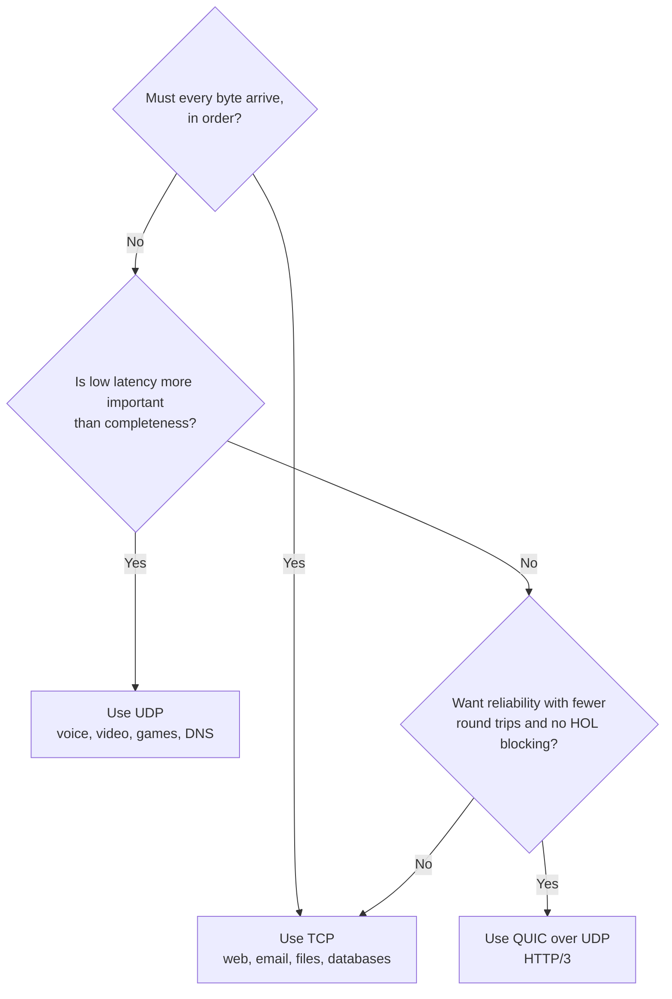

# Module 3: TCP & UDP - the Transport Layer


## How this module connects to Module 2

IP (Module 2) gets a packet to the right **host**. But IP makes no promises: a packet can be lost, duplicated, delayed or arrive out of order, and IP has no idea which _program_ on the host should receive it. The **Transport layer** fixes both problems. **Ports** pick the right program. **TCP** adds reliable, ordered delivery on top of unreliable IP. **UDP** adds almost nothing, and that is exactly why some applications want it.

## Words you will meet in this module

| Word                   | Simple meaning                                                                                |
| ---------------------- | --------------------------------------------------------------------------------------------- |
| **Port**               | A 16-bit number (0–65535) that picks one program on a host.                                   |
| **Socket**             | One end of a conversation: an IP address plus a port, used by a program.                      |
| **Segment / datagram** | The unit TCP sends / the unit UDP sends.                                                      |
| **Sequence number**    | A number on each TCP byte so the receiver can put the data in order.                          |
| **ACK**                | An acknowledgment: "I have received everything up to this number."                            |
| **RTT**                | Round-trip time: how long a request and its reply take.                                       |
| **RTO**                | Retransmission timeout: how long to wait for an ACK before sending again.                     |
| **MSS**                | Maximum Segment Size: the most data TCP puts in one segment (usually 1460 bytes).             |
| **Window**             | How much data may be sent without waiting for an ACK.                                         |
| **rwnd / cwnd**        | Receiver window (what the receiver can take) / congestion window (what the network can take). |
| **Flow control**       | Stops a fast sender from overwhelming a slow _receiver_.                                      |
| **Congestion control** | Stops senders from overwhelming the _network_.                                                |
| **HOL blocking**       | Head-of-line blocking: one lost item makes everything behind it wait.                         |

## 3.1: The Transport Layer, Ports and Sockets

### The idea in plain words

A building has one street address (the IP address), but many offices inside. The **port number** is the office number: it tells the host which program should receive the data. A web server, an SSH server and a database can all run on one machine, each listening on its own port.

This is called **multiplexing** (many programs share one network connection, on the sending side) and **demultiplexing** (the host sorts arriving data to the right program, on the receiving side).



### Port numbers

| Range         | Name                          | Use                                                                                              |
| ------------- | ----------------------------- | ------------------------------------------------------------------------------------------------ |
| 0 – 1023      | **Well-known ports**          | Standard services. On Unix, binding needs special privilege.                                     |
| 1024 – 49151  | **Registered ports**          | Applications registered with IANA (for example 3306, 5432).                                      |
| 49152 – 65535 | **Dynamic / ephemeral ports** | Temporary ports picked by the OS for _client_ connections. (Linux default range is 32768–60999.) |

Ports you should know:

| Port    | Service                                   | Transport     |
| ------- | ----------------------------------------- | ------------- |
| 20 / 21 | FTP data / control                        | TCP           |
| 22      | SSH                                       | TCP           |
| 25      | SMTP (mail sending)                       | TCP           |
| 53      | DNS                                       | UDP (and TCP) |
| 67 / 68 | DHCP server / client                      | UDP           |
| 80      | HTTP                                      | TCP           |
| 123     | NTP (time)                                | UDP           |
| 443     | HTTPS (and HTTP/3 over QUIC uses UDP 443) | TCP, UDP      |
| 3306    | MySQL                                     | TCP           |
| 5432    | PostgreSQL                                | TCP           |
| 6379    | Redis                                     | TCP           |

### Sockets and the 5-tuple

A **socket address** is an IP address and a port: `203.0.113.10:443`. A TCP connection is identified by **five values**, the **5-tuple**:

```
(protocol, source IP, source port, destination IP, destination port)
```

Two clients, or even two connections from the same client, are told apart because at least one value differs. The client's **source port** is picked by the operating system from the ephemeral range, so one browser can open many connections to the same server port 443 without confusion.

A server has one **listening socket** (for example port 443). Each time a client connects, the OS creates a **new connected socket** for that conversation. The server keeps the same local port, and each connection has a different 5-tuple.

### Sockets in code

A tiny TCP echo server and client in Python:

```python
## server.py
import socket

with socket.socket(socket.AF_INET, socket.SOCK_STREAM) as srv:
    srv.setsockopt(socket.SOL_SOCKET, socket.SO_REUSEADDR, 1)
    #srv.bind(("0.0.0.0", 9000))      # claim port 9000 on all interfaces
    #srv.listen()                     # start accepting connections
    #conn, addr = srv.accept()        # wait for one client (handshake happens here)
    with conn:
        print("connected from", addr)
        #while data := conn.recv(1024):   # read until the client closes
            #conn.sendall(data)           # echo it back
```

```python
## client.py
import socket

#with socket.create_connection(("127.0.0.1", 9000)) as s:   # handshake happens here
    s.sendall(b"hello")
    #print(s.recv(1024))                                     # b'hello'
```

`SOCK_STREAM` means TCP. Topic 3.2 uses `SOCK_DGRAM`, which means UDP. See what is listening on your machine with:

```
#$ ss -tulpn          # t = TCP, u = UDP, l = listening, p = program, n = numeric
```

### Interview traps

- "A server can handle only 65,535 connections because there are 65,535 ports." **Wrong.** The server uses one port for all clients. Each connection is a different 5-tuple. The real limits are memory, file descriptors and CPU.
- The **client** side can run out of ports: one client IP can make only about 28,000 (Linux default) to 64,000 connections to _one_ destination IP and port (Q2).
- "Does the port identify the protocol?" Only by convention. Nothing stops you from running a web server on port 22.
- TCP port 53 and UDP port 53 are **different** endpoints.

### Tricky questions and answers

#### Q1 [SDE-1]: Thousands of users connect to one web server on port 443. How does the server tell their connections apart?

**Answer:** By the **5-tuple**. Every client has a different source IP, or a different source port, so every connection has a unique combination. The server's local IP and port (443) are the same for all, but the OS creates a separate connected socket for each accepted connection and uses the full 5-tuple to deliver each arriving segment to the right one.

#### Q2 [SDE-2/3]: A load balancer opens many connections to a single backend at `10.0.0.5:8080` and starts failing with "cannot assign requested address." Why, and what do you do?

**Answer:** It ran out of **ephemeral source ports** for that destination. For a fixed (source IP, destination IP, destination port), only the source port can vary, and the default range gives about 28,000 usable ports on Linux. Closed connections also sit in TIME_WAIT (Topic 3.4) for 60 seconds and keep their ports reserved. Fixes: **reuse connections** (keep-alive, connection pooling), widen the range (`net.ipv4.ip_local_port_range`), add **more source IPs** or **more backend IPs or ports** (each new destination gives a fresh set of 5-tuples), and avoid opening a new connection for every request.

## 3.2: UDP: Fast and Light

### The idea in plain words

**UDP** (User Datagram Protocol) is the simplest transport protocol. It takes your message, adds a tiny header with the ports, and hands it to IP. That is all. It does **not**:

- set up a connection first (**connectionless**),
- guarantee delivery,
- guarantee order,
- remove duplicates,
- slow down when the network is busy.

Think of **postcards**: you drop each one in the mailbox. They may arrive out of order, and one may never arrive, but sending is instant and cheap.

### The UDP header (8 bytes)

```
| Source port | Destination port | Length  | Checksum |
|   2 bytes   |     2 bytes      | 2 bytes | 2 bytes  |
```

- The **checksum** lets the receiver detect damaged data. It is optional in IPv4 but **mandatory in IPv6**.
- UDP **keeps message boundaries**: one `sendto()` of 100 bytes is received as one datagram of 100 bytes. (TCP does not, see Topic 3.3.)
- The largest UDP payload over IPv4 is 65,535 − 20 (IP) − 8 (UDP) = **65,507 bytes**, but anything larger than the path MTU gets fragmented, which is risky. Applications keep datagrams small.

### Where UDP is used

| Use                                       | Why UDP fits                                                                |
| ----------------------------------------- | --------------------------------------------------------------------------- |
| **DNS**                                   | One small question and one small answer. A handshake would double the time. |
| **DHCP**                                  | The client has no IP address yet, so it cannot make a connection.           |
| **Voice and video calls, live streaming** | An old packet is useless. Better to skip it than wait for a retransmit.     |
| **Online games**                          | The latest position matters. Old updates are worthless.                     |
| **NTP, SNMP, syslog**                     | Simple, small, frequent messages.                                           |
| **QUIC / HTTP/3**                         | Builds its own reliability on top of UDP (Topic 3.8).                       |
| **Broadcast and multicast**               | TCP is one-to-one only. UDP can send to many.                               |

A UDP example in Python:

```python
## udp_server.py
import socket
#s = socket.socket(socket.AF_INET, socket.SOCK_DGRAM)   # SOCK_DGRAM = UDP
s.bind(("0.0.0.0", 9001))
#data, addr = s.recvfrom(2048)       # no accept(): there is no connection
s.sendto(data.upper(), addr)
```

```python
## udp_client.py
import socket
s = socket.socket(socket.AF_INET, socket.SOCK_DGRAM)
#s.sendto(b"ping", ("127.0.0.1", 9001))   # no connect, no handshake
#print(s.recvfrom(2048))                  # (b'PING', ('127.0.0.1', 9001))
```

### Interview traps

- "UDP is unreliable, so it is bad." It is a **trade-off**, not a defect. The application can add exactly the reliability it needs (QUIC does).
- "UDP has no congestion control." True at the protocol level. A badly written UDP application can **flood** a network. Real applications add their own rate control.
- A UDP "connection" in a firewall or NAT is only a **temporary table entry** with a timeout. Nothing is really connected.
- Sending to a closed UDP port produces an **ICMP "port unreachable"** reply. Sending to a closed TCP port gets a **TCP RST**.

### Tricky questions and answers

#### Q1 [SDE-2]: Why does DNS use UDP, and when does it switch to TCP?

**Answer:** A normal DNS lookup is one tiny question and one tiny answer, so UDP avoids the cost of a handshake and keeps no state on the server, which lets one server answer huge numbers of clients. DNS switches to **TCP** when the answer is too big for a UDP response (the server sets a "truncated" flag and the client retries over TCP), for **zone transfers** between DNS servers, and for encrypted DNS (DNS over TLS). Module 4 covers DNS in detail.

#### Q2 [SDE-2/3]: If UDP is unreliable, how do video calls still work well?

**Answer:** The **application** handles loss in ways that suit real-time media. It uses **jitter buffers** to smooth uneven arrival, **sequence numbers and timestamps** (RTP) to reorder and sync, **packet loss concealment** (guessing the missing audio), **forward error correction** (sending extra data so small losses can be repaired without a resend), and **adaptive bitrate** (lowering quality when the network gets worse). Retransmitting an old audio packet would arrive too late to play, so TCP's reliability would make the call _worse_.

## 3.3: TCP: Reliable, Ordered Byte Streams

### The idea in plain words

**TCP** (Transmission Control Protocol) is a phone call, not a postcard. First you **connect**. Then both sides talk, and TCP guarantees that:

- every byte arrives (it resends lost ones),
- bytes arrive **in order**,
- bytes arrive **once** (duplicates are removed),
- a fast sender does not overwhelm a slow receiver (**flow control**),
- senders slow down when the network is crowded (**congestion control**).

It builds all this on top of IP, which promises none of it. The price is extra headers, a setup delay, and waiting when something is lost.

Key properties:

- **Connection-oriented:** the two **end hosts** keep the connection state. Routers in the middle know nothing about it.
- **Full duplex:** both sides send and receive at the same time.
- **Byte stream:** TCP delivers a **stream of bytes**, with **no message boundaries**. See the trap below.

### The TCP header (20 to 60 bytes)

| Field                         | Size         | Purpose                                                                                                                   |
| ----------------------------- | ------------ | ------------------------------------------------------------------------------------------------------------------------- |
| Source port, destination port | 16 bits each | Pick the programs                                                                                                         |
| **Sequence number**           | 32 bits      | Position of the first byte in this segment                                                                                |
| **Acknowledgment number**     | 32 bits      | The next byte the sender expects to receive                                                                               |
| Data offset                   | 4 bits       | Header length (so a header is at most 60 bytes)                                                                           |
| **Flags**                     | 9 bits       | `SYN` (start), `ACK` (acknowledge), `FIN` (finish), `RST` (reset/abort), `PSH` (push to application), `URG`, `ECE`, `CWR` |
| **Window**                    | 16 bits      | How many more bytes the receiver can accept (flow control)                                                                |
| Checksum                      | 16 bits      | Detects damage. Mandatory                                                                                                 |
| Options                       | variable     | **MSS**, **window scale**, **SACK**, **timestamps**                                                                       |

**Sequence numbers count bytes, not segments.** If a segment starts at sequence 1001 and carries 500 bytes, the receiver replies with **ACK 1501** ("I have everything below 1501, send 1501 next").

### The byte stream trap ("sticky packets")

Suppose a program calls `send()` twice, with "HELLO" and then "WORLD". The receiver may get `HELLOWORLD` in **one** `recv()`, or `HEL` and then `LOWORLD`, because TCP only promises the **order of bytes**, not where the boundaries fall. So any protocol on top of TCP must mark its own message boundaries: a **length prefix** (read 4 bytes saying "the next message is N bytes"), a **delimiter** (a newline, as in HTTP headers), or fixed-size messages. This is the reason protocols like HTTP, Redis and gRPC define a framing format.

### Interview traps

- "TCP sends messages." It sends a **stream**. There are no message boundaries.
- "TCP guarantees delivery." Strictly, it guarantees either **delivery or a notification of failure** (the connection breaks). It cannot force data through a dead network.
- "A TCP ACK means the application has read the data." No. It only means the receiver's **operating system** has received it into its buffer.
- Checksums are weak by modern standards. Data integrity against attackers needs **TLS**, not TCP.

### Tricky question and answer

#### Q1 [SDE-2]: A sender calls `send()` twice with 100 bytes each. The receiver's first `recv(1024)` returns 200 bytes. Is this a bug?

**Answer:** No, this is normal TCP behavior. TCP is a byte stream and may combine or split data however it likes (Nagle's algorithm, segment sizes, buffering). The fix is in the application protocol: add **framing**, such as a length prefix before each message, and loop on `recv()` until a full message has been read.

## 3.4: Connection Setup and Teardown

### The three-way handshake

Before sending data, TCP agrees on **initial sequence numbers (ISN)** in both directions. It takes three messages:



1. **SYN:** the client says "I want to connect, and my first sequence number is `x`."
2. **SYN-ACK:** the server says "OK, my first sequence number is `y`, and I expect your next byte to be `x+1`."
3. **ACK:** the client says "Got it, I expect your next byte to be `y+1`."

Facts:

- Each side picks a **random ISN**, so old stray packets from earlier connections and blind attackers cannot easily guess it.
- A `SYN` counts as **one sequence number**, which is why the acknowledgment is `x+1`.
- The handshake costs **one full round trip (1 RTT)** before the client can send data. Adding TLS adds more round trips (Module 4).
- The `SYN` packets also carry **options** such as MSS, window scale and SACK permission.

### Closing a connection

Each direction is closed separately, so closing normally takes four messages:



- **FIN** means "I have no more data to send." The other side may keep sending (a **half-close**).
- **RST** (reset) is the abrupt way: "forget this connection now." It is sent when data arrives for a port with no listener, when an application crashes, or when something is clearly wrong.

### The TCP state machine

The connection moves through states, and `ss` or `netstat` shows them. Here is the simplified path:



(Real TCP also has `CLOSING` for when both sides close at the same moment, and a "simultaneous open." They are rare.)

#### The two states interviewers love

**TIME_WAIT** (on the side that closed first, lasting **2 × MSL**, which is 60 seconds on Linux):

- It makes sure the **last ACK can be re-sent** if it was lost (the peer would retransmit its FIN).
- It lets **old duplicate segments** from the finished connection die out, so they cannot be mistaken for data in a new connection that reuses the same 5-tuple.
- It is **normal and healthy**. A very large number on a busy client or proxy can exhaust ports.

**CLOSE_WAIT** (on the side that _received_ a FIN):

- It means "the peer closed, but **my application has not called `close()` yet**."
- Many sockets stuck in CLOSE_WAIT are an **application bug** (a socket leak). The OS cannot fix it.

### Attacks and defenses

- **SYN flood:** an attacker sends many SYNs and never finishes the handshake, filling the server's table of half-open connections. Defense: **SYN cookies** (the server encodes the connection details into its sequence number and keeps no state until the final ACK arrives), larger backlogs, rate limits and upstream filtering.
- **TCP RST injection:** a forged RST can kill a connection if the attacker guesses the sequence number window. Randomized ISNs make this hard.

### Interview traps

- "Why is it **three-way**, and not two?" See Q1.
- "TIME_WAIT is a problem and should be removed." No. It protects correctness. Fix the **cause** (too many short connections) with connection reuse. Options like `tcp_tw_reuse` (safe for _outgoing_ connections when TCP timestamps are on) exist, but the old `tcp_tw_recycle` was dangerous with NAT and was **removed** from Linux.
- Mixing up TIME_WAIT (normal) and CLOSE_WAIT (usually a bug).
- Forgetting that a **half-open connection** (one side crashed without sending FIN) can stay "ESTABLISHED" on the other side until it tries to send. **Keepalives** detect this.

### Tricky questions and answers

#### Q1 [SDE-2]: Why does TCP need a three-way handshake? Why would two messages not be enough?

**Answer:** Both sides need to **choose an initial sequence number and have it confirmed** by the other side. SYN and SYN-ACK confirm the client's number, and the final ACK confirms the server's number. With only two messages, the server could not know that the client received its sequence number, and an **old duplicate SYN** (delayed in the network) would make the server open a connection that the client never asked for, wasting resources. The third message proves the client is alive and really wants this connection.

#### Q2 [SDE-2/3]: A server shows 20,000 sockets in TIME_WAIT and 5,000 in CLOSE_WAIT. Which is the problem?

**Answer:** **CLOSE_WAIT** is the more suspicious number. TIME_WAIT is a normal result of many short connections being closed by this side, and it resolves itself in 60 seconds. CLOSE_WAIT means the **peers have closed their side, but the local application never closed its sockets**, which is a **leak** (a missing `close()`, an exception path that skips cleanup, or a stuck thread). Left alone, it exhausts file descriptors. For TIME_WAIT, you would reduce short-lived connections instead, with keep-alive and pooling.

#### Q3 [SDE-3]: How does a SYN flood work, and how do SYN cookies stop it?

**Answer:** A normal server must keep a half-open entry for every SYN it answered, until the third ACK arrives. An attacker sends a flood of SYNs (often from spoofed addresses) and never replies, so the table fills and real clients are refused. With **SYN cookies**, the server stores _nothing_ when it sends the SYN-ACK. It encodes the connection details and a secret hash into the **sequence number** of the SYN-ACK. A real client's final ACK returns that number plus one, so the server can **recompute and verify** it, and only then allocate state. A spoofed attacker never sees the SYN-ACK, so it cannot complete the handshake, and the server's memory is not consumed.

## 3.5: Reliability: Sequence Numbers, ACKs and Retransmission

### The idea in plain words

TCP numbers every byte. The receiver tells the sender "I have everything **up to** number N," and the sender knows what to re-send if that number stops moving. TCP's ACKs are **cumulative**: an ACK of 5001 means "everything from the start up to byte 5000 has arrived."

### How loss is detected

TCP has two main signals:

1. **Timeout:** no ACK arrives within the **RTO** (retransmission timeout). TCP measures the RTT of recent packets and sets the RTO a bit above it (with a 1-second starting value). If a retransmission is also lost, the timeout **doubles** each time (**exponential backoff**). This is slow.
2. **Duplicate ACKs (fast retransmit):** if one segment is lost but later ones arrive, the receiver keeps sending the **same ACK** for the missing number. When the sender sees **3 duplicate ACKs**, it resends the missing segment _immediately_, without waiting for the timeout.



Notice the receiver kept segments 3, 4 and 5 in its buffer. When segment 2 finally arrived, it could acknowledge all the way to 5001 in one step.

### SACK (Selective Acknowledgment)

A cumulative ACK cannot say "I also have 2001–5000." **SACK**, a TCP option negotiated in the handshake, lets the receiver list the extra blocks it holds, so the sender resends **only the truly missing** data. It is on by default almost everywhere.

### Other reliability tools

- **Checksum:** detects damaged segments, which are then treated as lost.
- **Duplicate removal:** the receiver discards segments whose sequence numbers it already has.
- **Reordering:** out-of-order segments wait in the buffer until the gap is filled.

### Interview traps

- "TCP retransmits every lost packet after a timeout." Mostly it uses **fast retransmit** first. Timeouts are the slow path and are costly (they also collapse the congestion window, Topic 3.7).
- ACKs say "I expect this next," not "I received this one." Mixing these up gives off-by-one errors in sequence diagrams.
- The **first** retransmission timeout usually starts at about 1 second, so a single timeout is very visible to users.

### Tricky questions and answers

#### Q1 [SDE-2]: Trace the example above. Why does the receiver send ACK 1001 three more times?

**Answer:** Segment 2 (bytes 1001–2000) is missing. Each later segment that arrives out of order makes the receiver repeat "the next byte I need is still 1001." That produces three duplicate ACKs, which the sender reads as "later data is getting through, so this one is probably lost, not just slow." It resends segment 2 at once. When it arrives, the receiver already holds bytes up to 5000 and answers **ACK 5001**.

#### Q2 [SDE-3]: Why does a single lost packet hurt a TCP stream more than just that packet's delay?

**Answer:** Two effects. First, **head-of-line blocking**: TCP must deliver bytes **in order**, so everything behind the lost segment sits in the receiver's buffer and the application sees nothing until the gap is filled, even though the later data already arrived. Second, TCP treats loss as a **congestion signal** and shrinks its sending rate (Topic 3.7). A timeout is worse than fast retransmit because it also resets the window to its minimum.

## 3.6: Flow Control: Not Overwhelming the Receiver

### The idea in plain words

A fast sender can easily overflow a slow receiver's buffer. So every ACK carries a **window** value: "I can accept this many more bytes." The sender may have at most that much **unacknowledged** data in flight. This is the **receive window (rwnd)**, and the mechanism is the **sliding window**.

```
Bytes:   [ sent and ACKed ][ sent, waiting for ACK ][ may send now ][ cannot send yet ]
                           ▲                         ▲
                     left edge (ACK)         right edge = left edge + window

When a new ACK arrives, the left edge moves right, and the window "slides" forward.
```

- If the receiver's application reads slowly, the buffer fills and the advertised window shrinks. If it reaches **zero**, the sender stops and sends small **window probes** until space opens up.
- The window field is only 16 bits (max 65,535 bytes), which is too small for fast, long links. The **window scale** option (agreed in the handshake) multiplies it, allowing windows up to about **1 GB**.

### Throughput limit from the window

A sender can send at most **one window per round trip**:

```
max throughput ≈ window / RTT
```

This ties back to the bandwidth-delay product in Module 1. To fill a link, the window must be at least the **BDP** (bandwidth × RTT).

| Window           | RTT                     | Max throughput       |
| ---------------- | ----------------------- | -------------------- |
| 64 KB            | 1 ms (same data center) | ≈ 64 MB/s ≈ 500 Mbps |
| 64 KB            | 50 ms                   | ≈ 1.3 MB/s ≈ 10 Mbps |
| 64 KB            | 100 ms                  | ≈ 655 KB/s ≈ 5 Mbps  |
| 12.5 MB (needed) | 100 ms                  | 1 Gbps               |

### Interview traps

- "More bandwidth fixes slow transfers." Not if the **window** limits you. A 1 Gbps link at 100 ms RTT needs a **12.5 MB window**. A 64 KB window gives about 5 Mbps.
- Forgetting **window scaling** in old firewalls or middleboxes that strip TCP options. The result is a mysterious speed cap of about 64 KB / RTT.
- Mixing up **flow control** (protects the receiver, uses the receiver's window) with **congestion control** (protects the network, uses the sender's congestion window).

### Tricky questions and answers

#### Q1 [SDE-2]: A transfer over a 1 Gbps link with 100 ms RTT only reaches about 5 Mbps. What is the most likely cause?

**Answer:** The **window is too small**. With a 64 KB window, throughput ≤ 64 KB / 0.1 s ≈ 5 Mbps, whatever the link speed. To use the full 1 Gbps, the window must reach the BDP = 1 Gbps × 100 ms = 12.5 MB. Check that **window scaling** is enabled on both ends and not stripped by a middlebox, and that the OS socket buffers are large enough.

#### Q2 [SDE-2/3]: What happens when a receiver's window drops to zero?

**Answer:** The sender **stops sending data**. It periodically sends tiny **window probe** segments (with a timer that backs off) to ask if space has opened up. When the receiver's application reads data, the receiver sends a **window update** with a non-zero window, and the sender resumes. A permanently zero window often means the receiving application is stuck or too slow.

## 3.7: Congestion Control: Not Overwhelming the Network

### The idea in plain words

Flow control protects the receiver. But what protects the **network** in the middle? If every sender transmits as fast as it can, routers' queues overflow and packets are dropped, which causes retransmissions, which makes things even worse (**congestion collapse**, which really happened to the early Internet in 1986).

TCP's answer: each sender keeps a second window, the **congestion window (cwnd)**. It starts small, grows while all is well, and shrinks when loss is detected. The sender may have at most:

```
in flight  ≤  min( cwnd , rwnd )
```

The sender has no direct view of the network, so it **infers congestion from packet loss** (or, in newer algorithms, from rising delay).

### The phases (classic TCP Reno)



1. **Slow start:** despite the name, it is exponential. For every ACK, `cwnd` grows by one MSS, so it **doubles every RTT**. It continues until it reaches the **slow start threshold (ssthresh)**, or until loss.
2. **Congestion avoidance:** above `ssthresh`, growth is **linear**: about **+1 MSS per RTT**. This carefully probes for more bandwidth.
3. **On loss:**
   - **3 duplicate ACKs** (mild: packets are still getting through): halve the window (`ssthresh = cwnd/2`, `cwnd = ssthresh`) and continue. This is **fast recovery**.
   - **Timeout** (severe): set `ssthresh = cwnd/2` and drop `cwnd` back to **1 MSS**, then slow start again.

This rule, **additive increase, multiplicative decrease (AIMD)**, makes competing flows converge to a **fair share** of a link. The window therefore forms a repeating **sawtooth** shape: climb slowly, halve on loss, climb again.

### Modern algorithms

| Algorithm          | Idea                                                                                                                                                       |
| ------------------ | ---------------------------------------------------------------------------------------------------------------------------------------------------------- |
| **Reno / NewReno** | The classic AIMD described above.                                                                                                                          |
| **CUBIC**          | Linux default for years. The window grows as a cubic curve, so it recovers faster on high-bandwidth, high-latency links.                                   |
| **BBR** (Google)   | Does not wait for loss. It **estimates the bottleneck bandwidth and minimum RTT** and paces packets to match. Performs much better on lossy or long links. |

The initial window is **10 MSS** (about 14.6 KB) on modern systems (RFC 6928).

### Why this matters for real traffic

- A **new connection starts slowly.** A small web page (under about 14 KB) can finish within the first window. Larger responses need several RTTs to ramp up. This is why **reusing connections** (keep-alive, HTTP/2, connection pools) and **CDNs** (shorter RTT) make pages feel faster.
- On **Wi-Fi or satellite**, packets are lost for reasons _other than congestion_. Classic TCP still shrinks its window, so throughput suffers. BBR copes better.
- Loss-based algorithms **fill router buffers** before they see loss, causing **bufferbloat**: high latency under load.

### Interview traps

- "Slow start is slow." It is **exponential**, and fast. It is "slow" only compared with sending at full speed instantly.
- Mixing up **rwnd** and **cwnd**. Effective window = `min(rwnd, cwnd)`.
- Treating all loss the same. **Duplicate ACKs** (mild) halve the window. A **timeout** (severe) resets it to 1 MSS.
- "UDP does not need congestion control." It does. A UDP sender that ignores congestion harms every TCP flow sharing the link, so well-behaved UDP protocols (including QUIC) implement their own.

### Tricky questions and answers

#### Q1 [SDE-2]: What is the difference between flow control and congestion control?

**Answer:** **Flow control** protects the **receiver**: the receiver advertises its free buffer space (**rwnd**) in every ACK. **Congestion control** protects the **network**: the sender maintains a **cwnd**, grows it while things go well, and cuts it on loss. They run together, and the sender may have at most `min(cwnd, rwnd)` bytes in flight.

#### Q2 [SDE-2/3]: Why does a new HTTP connection to a faraway server feel slow even on a fast link?

**Answer:** Three costs stack up. First, the **handshake** takes 1 RTT (plus TLS round trips, Module 4). Second, **slow start** begins with a small window (about 14 KB), so a large response needs several RTTs to speed up. Third, a long RTT multiplies each of these. A fast link helps none of them. Better fixes are a **CDN** (a shorter RTT), **connection reuse**, **TLS session resumption**, and HTTP/3, which cuts handshake round trips.

#### Q3 [SDE-3]: Draw the congestion window over time for a connection that suffers one timeout and one triple-duplicate-ACK event.

**Answer:** Start at 10 MSS and grow **exponentially** (slow start). At `ssthresh`, switch to **linear** growth (+1 MSS per RTT). On a **triple duplicate ACK**, the window drops to **half**, then continues linearly from there (fast recovery). On a **timeout**, `ssthresh` becomes half of the current window, `cwnd` falls to **1 MSS**, and slow start restarts up to the new, lower `ssthresh`, after which it is linear again. The timeout produces a much deeper dip than the duplicate-ACK event.

## 3.8: TCP vs UDP vs QUIC: Choosing and Going Faster

### Side-by-side comparison

|                             | **TCP**                           | **UDP**                       |
| --------------------------- | --------------------------------- | ----------------------------- |
| Connection                  | Yes (handshake first)             | No                            |
| Reliability                 | Guaranteed (retransmits)          | None                          |
| Order                       | Guaranteed                        | Not guaranteed                |
| Data model                  | Byte stream (no boundaries)       | Datagrams (boundaries kept)   |
| Flow and congestion control | Built in                          | None                          |
| Header size                 | 20 – 60 bytes                     | 8 bytes                       |
| Speed and latency           | Slower start, waits on loss       | Fast, no waiting              |
| Broadcast / multicast       | No                                | Yes                           |
| Typical use                 | Web, email, files, databases, SSH | DNS, video/voice, games, QUIC |



### Two classic TCP latency problems

- **Nagle's algorithm** holds small writes until earlier data is acknowledged, to avoid sending many tiny packets. **Delayed ACK** makes the receiver wait (tens of milliseconds, up to about 200 ms) before acknowledging, hoping to piggyback the ACK on data. Together they can cause a mysterious **40 ms to 200 ms stall** in request-response programs that send a request in two small writes. The fix is to set **`TCP_NODELAY`** (disable Nagle) and to write each message in one call.
- **Head-of-line blocking:** TCP delivers strictly in order, so one lost segment stalls **everything** behind it, including unrelated data multiplexed on the same connection (such as the streams of HTTP/2).

### QUIC: TCP's ideas, rebuilt on UDP

**QUIC** (the transport under **HTTP/3**) runs over **UDP port 443** and rebuilds reliability and congestion control in **user space**. It fixes several TCP problems:

| Problem in TCP (+TLS)                                                               | How QUIC solves it                                                                  |
| ----------------------------------------------------------------------------------- | ----------------------------------------------------------------------------------- |
| Separate handshakes: TCP (1 RTT) then TLS (1–2 RTT)                                 | **Combined** transport and TLS 1.3 handshake: **1 RTT**, or **0-RTT** when resuming |
| HOL blocking across streams                                                         | Each **stream** is independent. A loss on one does not stall the others             |
| Connection tied to the 5-tuple, so it breaks when your IP changes (Wi-Fi to mobile) | **Connection IDs** let a connection **migrate** to a new IP and port                |
| Hard to change, because the OS kernel and middleboxes are involved                  | Lives in user space, so it can be updated with the application                      |
| Headers readable and changeable by middleboxes                                      | Almost everything, including most headers, is **encrypted**                         |

The trade-offs: QUIC uses more CPU, some networks throttle or block UDP, and debugging is harder because the packets are encrypted.

### Interview traps

- "QUIC is just UDP." QUIC _uses_ UDP only as a carrier. It adds reliability, ordering per stream, congestion control and encryption on top.
- "UDP is faster than TCP." Not always. For bulk transfers, TCP's congestion control makes it efficient and fair. UDP wins on **latency and flexibility**, not necessarily on throughput.
- Using UDP for something important without adding **any** reliability or ordering logic.

### Tricky questions and answers

#### Q1 [SDE-2]: You are building a multiplayer game. Which transport do you use for player positions, and which for chat or purchases?

**Answer:** **Positions: UDP.** They are sent many times per second, and only the newest one matters, so a lost one should simply be replaced by the next, not retransmitted late. Add sequence numbers so the game can ignore old updates. **Chat and purchases: TCP** (or a reliable layer on UDP), because every message must arrive, once and in order. Many games use both, or a custom protocol over UDP with selective reliability.

#### Q2 [SDE-2/3]: Why was HTTP/3 built on QUIC instead of improving TCP?

**Answer:** HTTP/2 multiplexes many streams over **one TCP connection**, so a single lost packet stalls all of them (**TCP head-of-line blocking**). Fixing that needs a change inside TCP, but TCP is implemented in operating system kernels and treated specially by **middleboxes** (firewalls, NATs), so changing it across the whole Internet is nearly impossible. QUIC runs over **UDP**, which passes through the network unchanged, and is implemented in user space, so it can be deployed and updated quickly. It also merges the transport and TLS handshakes, and supports **connection migration**.

#### Q3 [SDE-3]: A request-response service shows a steady 40 ms extra latency on some calls. What could be happening?

**Answer:** The classic cause is **Nagle's algorithm interacting with delayed ACK**. If the client sends a small request in two writes, Nagle holds the second small write until the first is acknowledged. The server's TCP delays that ACK (hoping to piggyback it on a response), and the fixed delay of about 40 ms appears. Fixes: set **`TCP_NODELAY`** on the socket, and **write the whole message in a single call** (or use scatter-gather writes). Confirm with a packet capture, where you would see two small segments separated by about 40 ms.

## Hands-On Lab: Watch TCP and UDP Work

**Part A: Observe a handshake**

```
#Terminal 1:   python3 server.py                       # from Topic 3.1
#Terminal 2:   sudo tcpdump -i lo -n 'tcp port 9000'   # (macOS: -i lo0)
Terminal 3:   python3 client.py
```

You should see lines like this (numbers will differ):

```
IP 127.0.0.1.54321 > 127.0.0.1.9000: Flags [S],  seq 1823005640, win 65495
IP 127.0.0.1.9000 > 127.0.0.1.54321: Flags [S.], seq 904221177, ack 1823005641
IP 127.0.0.1.54321 > 127.0.0.1.9000: Flags [.],  ack 1
IP 127.0.0.1.54321 > 127.0.0.1.9000: Flags [P.], seq 1:6, ack 1       <- "hello"
...
IP 127.0.0.1.54321 > 127.0.0.1.9000: Flags [F.], ...                  <- close
```

In `tcpdump`, `[S]` is SYN, `[S.]` is SYN-ACK, `[.]` is ACK, `[P.]` is data (PSH+ACK), `[F.]` is FIN, and `[R]` is RST. After the SYN, tcpdump shows **relative** sequence numbers.

**Part B: Look at connection states**

```
#1. ss -tan                           # all TCP connections and their states
#2. ss -tan state time-wait | wc -l   # how many sockets are in TIME_WAIT
#3. ss -s                             # summary of sockets by type and state
#4. nc -vz example.com 443            # is TCP port 443 reachable? (handshake test)
#5. nc -u -l 9001  (and in another terminal: nc -u 127.0.0.1 9001)   # UDP chat
```

**Part C: Try the byte-stream trap**

Change `client.py` to call `s.sendall(b"AAAA")` and then `s.sendall(b"BBBB")` immediately, and make the server print each `recv()` result. Do you ever see `b'AAAABBBB'` in one read? What would you add to make the messages separable?

Questions to answer for yourself:

- Which side of the connection enters TIME_WAIT: the one that closed first, or the other?
- What does `nc -vz` tell you that `ping` cannot?
- What happens if you connect to a port where nothing is listening? (Look for the RST.)

## Module 3 Cheat Sheet

| Concept                 | One-line interview answer                                                                                    |
| ----------------------- | ------------------------------------------------------------------------------------------------------------ |
| Transport layer         | Delivers data between **programs** using **ports**. TCP adds reliability, UDP does not.                      |
| Port ranges             | 0–1023 well-known, 1024–49151 registered, 49152–65535 ephemeral (Linux: 32768–60999).                        |
| 5-tuple                 | (protocol, src IP, src port, dst IP, dst port) uniquely identifies a connection.                             |
| Server connection limit | Not 65,535. Each connection is a different 5-tuple. Limits are memory and file descriptors.                  |
| UDP                     | 8-byte header, connectionless, unreliable, keeps message boundaries. Used for DNS, media, games, QUIC.       |
| TCP                     | Connection-oriented, reliable, ordered, byte stream (no boundaries), flow and congestion control.            |
| TCP header              | 20–60 bytes. Sequence and ACK numbers count **bytes**. ACK = next byte expected.                             |
| Three-way handshake     | SYN, SYN-ACK, ACK. Syncs initial sequence numbers. Costs 1 RTT.                                              |
| Teardown                | FIN, ACK, FIN, ACK. Half-close is possible. RST aborts immediately.                                          |
| TIME_WAIT               | Side that closed first waits 2×MSL (60 s Linux). Normal. Protects against old duplicates and lost final ACK. |
| CLOSE_WAIT              | Peer closed, but our app has not. Usually a socket leak bug.                                                 |
| SYN flood               | Fills half-open table. Defended by SYN cookies.                                                              |
| Loss detection          | Timeout (slow, RTO doubles) or 3 duplicate ACKs (fast retransmit). SACK resends only what is missing.        |
| Flow control            | Receiver window (rwnd). Throughput ≤ window / RTT. Window scaling for long fat links.                        |
| Congestion control      | cwnd. Slow start (exponential), congestion avoidance (+1 MSS/RTT), halve on 3 dup ACKs, reset on timeout.    |
| Effective window        | min(cwnd, rwnd).                                                                                             |
| Algorithms              | Reno (AIMD), CUBIC (Linux default), BBR (bandwidth and RTT based). Initial window 10 MSS.                    |
| Nagle + delayed ACK     | Can add 40–200 ms stalls. Fix with `TCP_NODELAY`.                                                            |
| HOL blocking            | One lost TCP segment delays all later data. QUIC streams avoid it.                                           |
| QUIC                    | Over UDP 443. 1-RTT or 0-RTT handshake with TLS 1.3, independent streams, connection migration. HTTP/3.      |

### Where this leads next

**Module 4 (DNS, HTTP & TLS: the Application Layer)** climbs to the top of the stack, where TCP (or QUIC) is the road and the applications are the traffic. You will see how a name like `example.com` becomes an IP address (DNS, with caching and record types), how HTTP requests and responses work and what changed in HTTP/1.1, HTTP/2 and HTTP/3, and how **TLS** encrypts the connection with certificates, building on the handshake round trips you learned here.
